# p5-single-line-font-resources

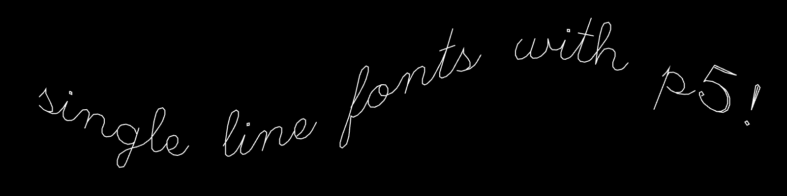

*This is a repository of p5.js (JavaScript) programs for loading and displaying single-line vector fonts (also called single-stroke or monoline fonts) in a variety of formats — including TTF, SVG Font, Hershey Font, and others. Such fonts are ideally suited to creative coding, pen-plotting, and CNC machining. Examples in this repository are known to work with [p5.js v.1.11.5](https://cdn.jsdelivr.net/npm/p5@1.11.5/lib/p5.js). The fonts draw from a wide range of creative projects, obsolete technologies, and other sources.*

---

#### Contents

* [p5.js Parser/Renderer for Single-Line TTF Fonts](#p5js-parserrenderer-for-single-line-ttf-fonts)
* [p5.js Parser/Renderer for Single-Line SVG Fonts](#p5js-parserrenderer-for-single-line-svg-fonts)
* [p5.js Parser/Renderer for (Classic) Hershey Fonts](#p5js-parserrenderer-for-classic-hershey-fonts)
* [Minimal SVG Font, Inlined in p5.js](#minimal-svg-font-inlined-in-p5js)
* [p5.js port of Kamp's HP1345A vector font](#p5js-port-of-kamps-hp1345a-vector-font)
* [p5.js port of Logg/Hudson's *Asteroids* font](#p5js-port-of-logghudsons-asteroids-font)
* [p5.js port of Hofstadter's *Letter Spirit* gridfonts](#p5js-port-of-hofstadters-letter-spirit-gridfonts)
* [p5.js port of JT Nimoy's *Textension* font](#p5js-port-of-jt-nimoys-textension-font)
* [p5.js port of Jared Schiffman's Font](#p5js-port-of-jared-schiffmans-font)
* [p5.js port of Moebio's *Typode* Font](#p5js-port-of-moebios-typode-font)
* [p5.js port of Anders Hoff's *GridFont*](#p5js-port-of-anders-hoffs-gridfont)
* [*minf*, an Ultra-Minimal Procedural Monoline Font](#minf-an-ultra-minimal-procedural-monoline-font)
* [Additional Resources](#additional-resources)
* [Some Inspirational Media](#some-inspirational-media)

---

### p5.js Parser/Renderer for Single-Line TTF Fonts

Genuine *single-line* TrueType (.TTF) fonts are comparatively rare, and are not rendered properly by most graphics tools — including commercial software like Adobe Illustrator, as well as p5's built-in `text()` command. Here, an [archive](p5_single_line_ttf_fonts/single_stroke_ttf_fonts/) of single-line TTF fonts is provided, as well as a p5.js [program](p5_single_line_ttf_fonts/) which is able to load, parse, display, and provide control points for those fonts:

* An [**archive**](p5_single_line_ttf_fonts/single_stroke_ttf_fonts/) of single-line TTF fonts, as suggested via [imajeenyus.com](http://www.imajeenyus.com/computer/20150110_single_line_fonts/index.shtml). Unlike Hershey fonts, many of these TTFs are constructed from quadratic Bézier segments, and thus have real curves instead of polylines. 
* A [**p5.js program**](p5_single_line_ttf_fonts/sketch.js) to load single-line TTFs in p5.js: In [this repository](p5_single_line_ttf_fonts/), and also at [editor.p5js.org](https://editor.p5js.org/golan/sketches/7kMYzCpfM). Note that the program makes use of [opentype.js](https://opentype.js.org/).
* These fonts have some quirks. Don't ignore these important [**technical notes**](p5_single_line_ttf_fonts/README.md) about the TTF fonts and p5.js code!

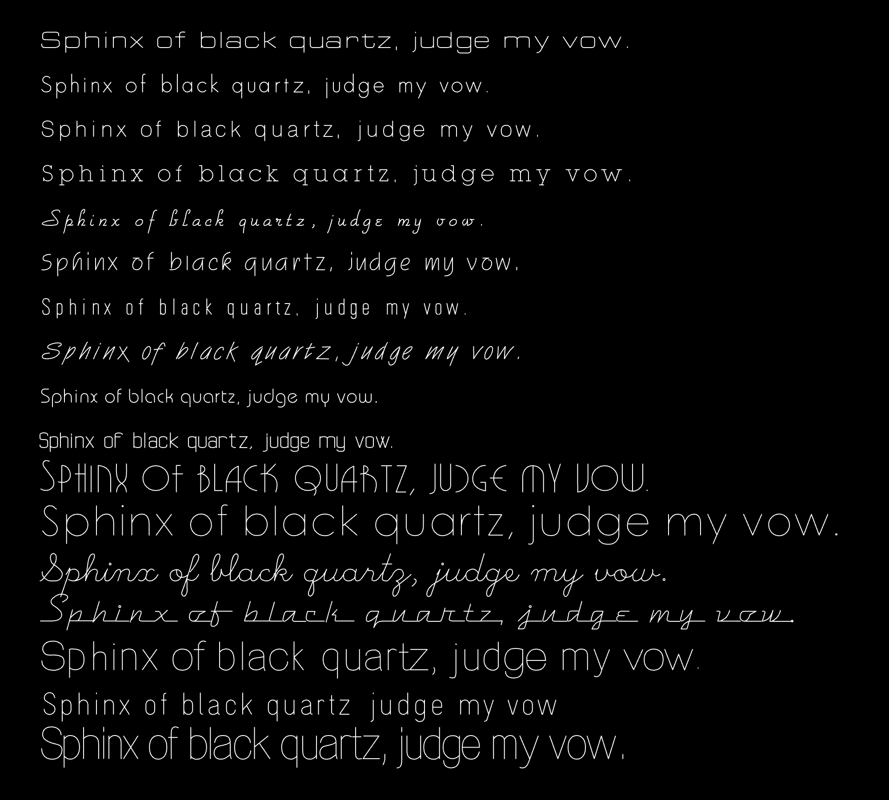

---

### p5.js Parser/Renderer for Single-Line SVG Fonts

SVG 1.1 Fonts are a lesser-known open standard, defined [here](https://www.w3.org/TR/SVG11/fonts.html), which allows for single-line vector fonts. A handful of single-line SVG Fonts have been created. [Here is a p5.js program](p5_single_line_svg_fonts/sketch.js) that parses and displays SVG Fonts:

* In [this repository](p5_single_line_svg_fonts/)
* At [editor.p5js.org](https://editor.p5js.org/golan/sketches/T-Vf4vvaR)

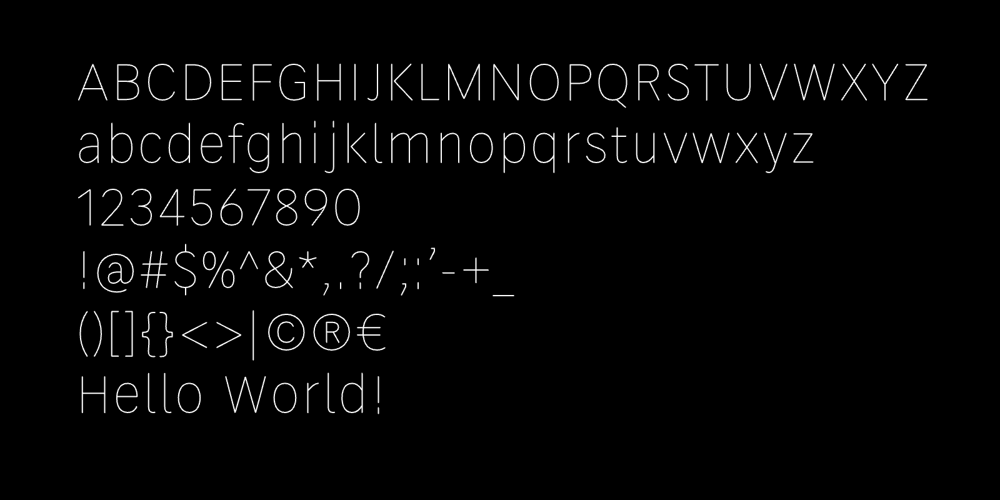

Shown above is the elegant [*Relief*](https://github.com/isdat-type/Relief-SingleLine/) open-source single-line SVG font (rendered by p5.js), developed by a team at the Graphic Design Department of the Institut Supérieur des Arts et du Design de Toulouse. Note that *Relief* is not a poly-linear font, but instead uses cubic Bézier curves with the SVG `C` (curveTo) and p5.js `bezier()` commands.

A large [archive](p5_single_line_svg_fonts/single_line_svg_fonts/README.md) of compatible SVG single-line fonts is included [here](p5_single_line_svg_fonts/single_line_svg_fonts/README.md), as a mirror of [a collection](https://gitlab.com/oskay/svg-fonts) curated by Evil Mad Scientist Laboratories. All of these fonts are supported by the p5.js project here. 

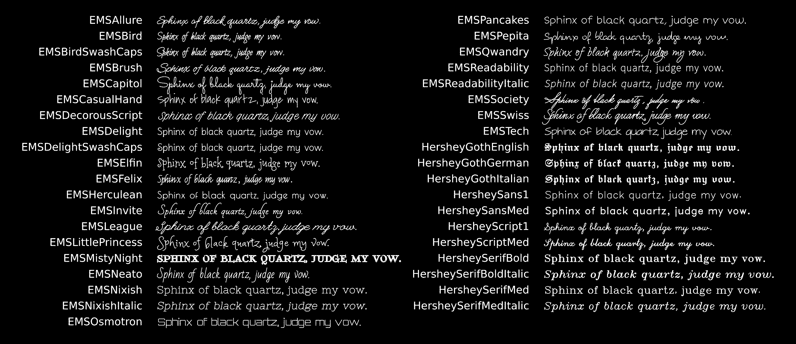

Some additional resources for SVG 1.1 Fonts are:

* [https://gitlab.com/oskay/svg-fonts](https://gitlab.com/oskay/svg-fonts)
* [https://github.com/Shriinivas/inkscapestrokefont](https://github.com/Shriinivas/inkscapestrokefont)
* [https://singlelinefonts.com/collections/svg-fonts](https://singlelinefonts.com/collections/svg-fonts)
* [https://github.com/isdat-type/Relief-SingleLine](https://github.com/isdat-type/Relief-SingleLine)
* [https://www.templatemaker.nl/singlelinetext](https://www.templatemaker.nl/singlelinetext/)

---

### p5.js Parser/Renderer for (Classic) Hershey Fonts

[Hershey Fonts](https://en.wikipedia.org/wiki/Hershey_fonts) are a collection of single-line vector fonts developed in 1967 by Dr. Allen V. Hershey at Dahlgren Naval Weapons Laboratory; they are some of the [earliest digital fonts](https://www.youtube.com/watch?v=xQNHAWrR_eg). The coordinate data for 1,377 Hershey font characters was published by NIST in 1976, in [*A Contribution to Computer Typesetting Techniques: Tables of Coordinates for Hershey's Repertory of Occidental Type Fonts and Graphic Symbols*](https://books.google.de/books?id=8DOGhKjPAyEC&redir_esc=y). Type designer/historian Frank Grießhammer has published a terrific [video lecture about The Hershey Fonts](https://www.youtube.com/watch?v=xQNHAWrR_eg) in 2015.

The authoritative p5.js interface to Hershey Fonts is the [p5-hershey-js](https://github.com/LingDong-/p5-hershey-js) library, by [Lingdong Huang](https://github.com/lingDong-/). (Note that the font data in Lingdong's p5-hershey-js is *not* stored in SVG format!) The p5-hershey-js library provides detailed control of Hershey typography; in this section, I provide some practical p5.js programs that use this library. 

#### hershey-font-demo-svg

This program ([**here**](Hershey/hershey-font-demo-svg/) or at [editor.p5js.org](https://editor.p5js.org/golan/sketches/HufYAfKQr)) provides a simple introduction to the [p5-hershey-js](https://github.com/LingDong-/p5-hershey-js) library. It demonstrates how to: 

* Display text using the default Hershey font
* Display text using a specific Hershey font
* Display text using Lingdong Huang's Chinese Hershey fonts
* Position a Hershey glyph with a specific translation, scale, and rotation.
* *Export* these graphics to an SVG file, using the [p5.plotSvg](https://github.com/golanlevin/p5.plotSvg) library

[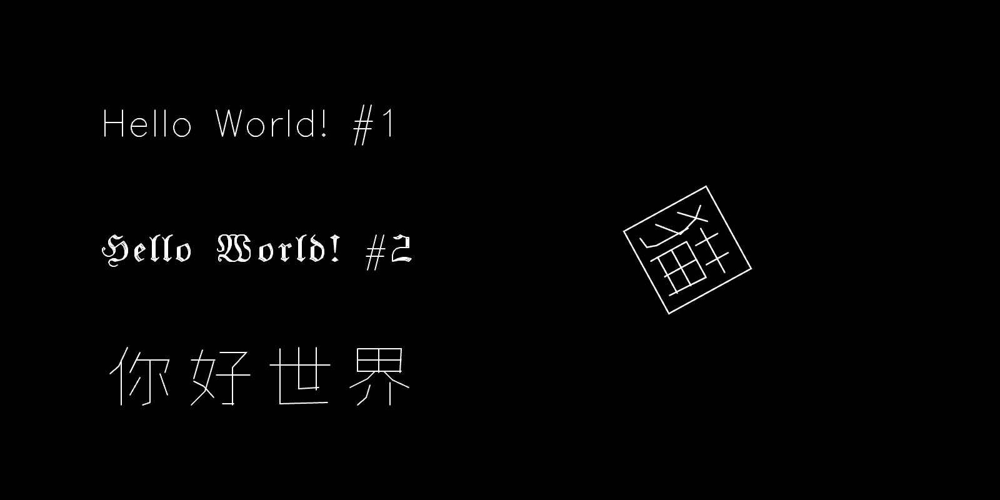](Hershey/hershey-font-demo-svg/)

#### pointwise-hershey-to-svg

This program ([**here**](Hershey/pointwise-hershey-to-svg/) or at [editor.p5js.org](https://editor.p5js.org/golan/sketches/2PJpYMHo1)) also uses the [p5.plotSvg](https://github.com/golanlevin/p5.plotSvg) library to export SVG files of the graphics rendered onscreen. In particular, this demo shows how the [p5-hershey-js](https://github.com/LingDong-/p5-hershey-js) library can be used to render Hershey fonts in 3 different ways: 

1. "Simple", using Lingdong's library API;
2. "Custom", allowing for your own pointwise manipulations;
3. "Single Line", in which all text is an unbroken polyline. 

[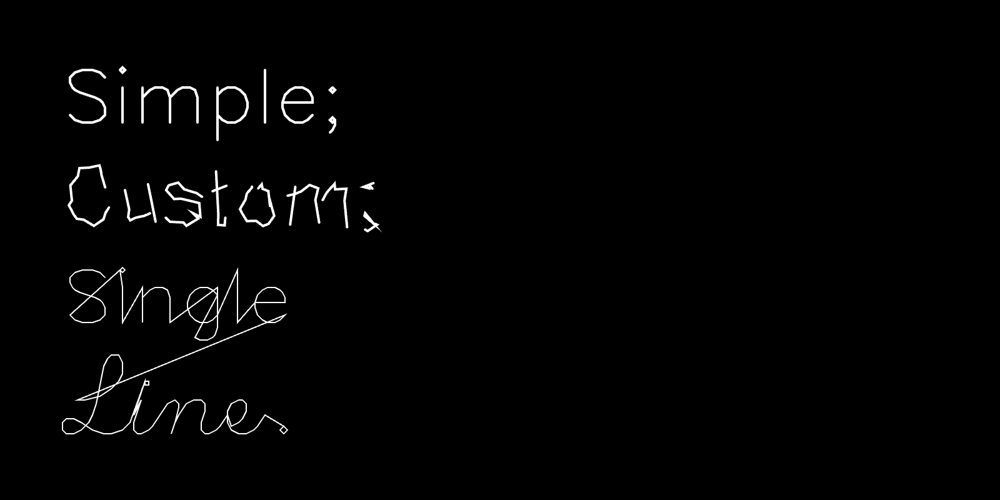](Hershey/pointwise-hershey-to-svg/)

Also noteworthy are these additional Hershey+p5 resources:

* Lingdong Huang has made a helpful [Hershey Font Editor](https://hfedit.glitch.me/). A backup of this project has been archived [here](lingdong_hfedit/index.html).
* [chinese-hershey-font](https://github.com/LingDong-/chinese-hershey-font), also by Lingdong Huang.

---

### Minimal SVG Font, Inlined in p5.js

*This minimal program presents a SVG font inlined in p5.js, with no loading of external resources.*

The program presented [here](Hershey/Hershey_inline_font/sketch.js) and at [editor.p5js.org](https://editor.p5js.org/golan/sketches/iqRjuCM-5) displays an *inlined* SVG font in p5.js. This program may be useful in circumstances when you just need a simple single-line font, and do not wish to load external files or have any additional library dependencies. 

The typeface happens to be a Hershey (polyline) font, converted to the SVG Font format. Note that additional Hershey fonts have also been converted to SVG Font format and are available e.g. [here](https://gitlab.com/oskay/svg-fonts/-/tree/master/fonts/Hershey), [here](https://github.com/Shriinivas/inkscapestrokefont/tree/master/strokefontdata), and [here](https://github.com/techninja/hersheytextjs), as discussed above. This code been adapted from [hershey font json example](https://editor.p5js.org/allison.parrish/sketches/SJv2DCYpQ) by Allison Parrish.

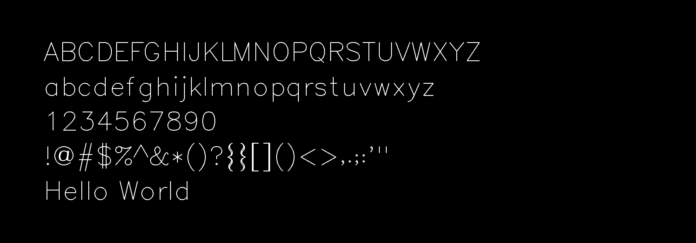

---

### p5.js port of Kamp's HP1345A vector font

This single-line font is from the character generator ROM of the HP1345A digital vector display (c.1985), [reverse-engineered](https://phk.freebsd.dk/hacks/Wargames/index.html) by Poul-Henning Kamp, and ported to JavaScript by Golan Levin. This p5.js version is adapted from his work, and loads data from the original ROM binaries.

* ROM-loading version [here](HP1345A/HP1345A_single_line_font/sketch.js) or at [editor.p5js.org](https://editor.p5js.org/golan/sketches/ir_bD05uZ)
* Data-inlined version (*recommended*) [here](HP1345A/HP1345A_single_line_font_inline) or at [editor.p5js.org](https://editor.p5js.org/golan/sketches/TzKV33v9g)

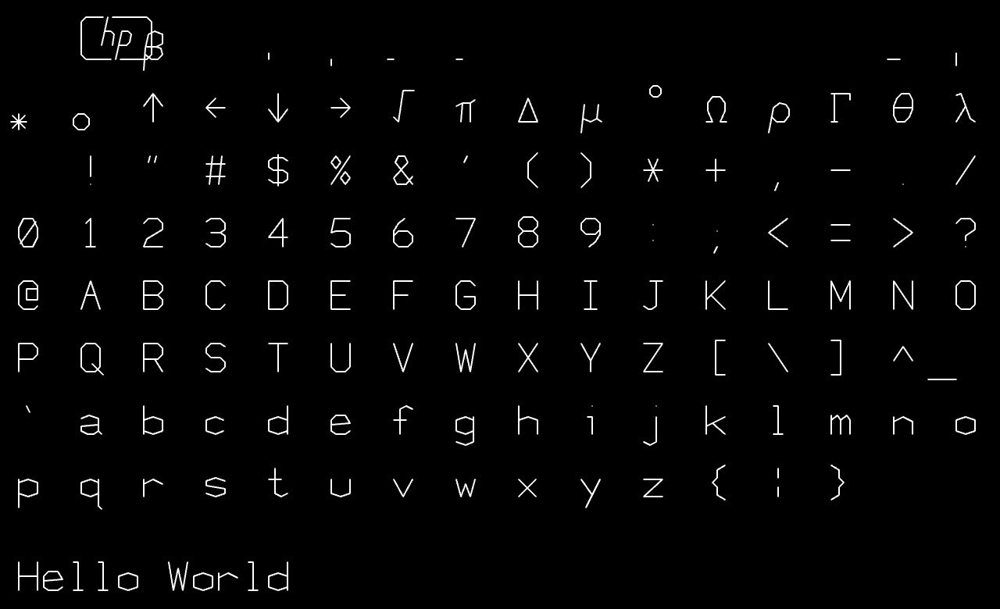

---

### p5.js port of Logg/Hudson's *Asteroids* font

Asteroids game vector font by [Atari programmer Ed Logg](https://web.archive.org/web/20141222010537/http://www.edge-online.com/features/making-asteroids/), c.1979, converted to C by [Trammell Hudson](https://trmm.net/Asteroids_font/), ported to p5.js by Golan Levin. Original C data [here](https://github.com/osresearch/vst/blob/master/teensyv/asteroids_font.c).

* In [this repository](Asteroids_single_line_font/sketch.js)
* At [editor.p5js.org](https://editor.p5js.org/golan/sketches/OmiU51Gdm)

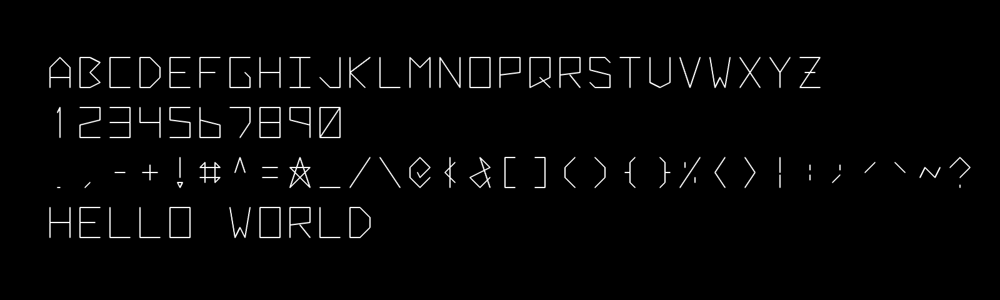

---

### p5.js port of Hofstadter's *Letter Spirit* gridfonts

Douglas Hofstadter’s *Letter Spirit* project (c.1987-1996) explores how abstract concepts like "style" and "analogy" underpin both perception and creativity. It models the human capacity to perceive coherence and invent variation within constraints, proposing that the essence of intelligence lies in fluid, context-sensitive pattern recognition rather than rigid rule-following.

The code in this directory implements some of the *Letter Spirit* gridfonts devised by Hofstadter and Gary McGraw in [*Letter Spirit: An Emergent Model of the Perception and Creation of Alphabetic Style*](hofstadter_letter_spirit_fonts/1993-hofstadter.pdf) (1993). In these fonts, each glyph consists of an array of strokes, and each stroke connects points in a 3x7 design lattice.

* In [this repository](hofstadter_letter_spirit_fonts/letter_spirit_fonts/sketch.js)
* At [editor.p5js.org](https://editor.p5js.org/golan/sketches/_sQ_9xkI4)

---

### p5.js port of JT Nimoy's *Textension* font

This repository presents is a p5.js recovery of the handcoded monoline font from [*Textension: Word Processor Variations*](https://jtnimoy.cc/item.php%3Fhandle=14882287-textension-word-processor-variations.html) (1999), an interactive Windows 95/98/XP program developed by JT Nimoy at the Aesthetics & Computation Group of the MIT Media Laboratory. A screen recording of *Textension* can be found [here](https://player.vimeo.com/video/6121230). Nimoy wrote: 

> *"Textension was a collection of 10 interactive experiments in making creative variations of word processing applications. It was my response as an artist to the way programmers always use the typewriter metaphor when they are creating a typesetting application. Textension combines the metaphor of the typewriter with that of other things in the physical world, such as the act of blowing soap bubbles."*

* In [this repository](nimoy_textension/sketch.js)
* At [editor.p5js.org](https://editor.p5js.org/golan/sketches/D4hUCWZk7)

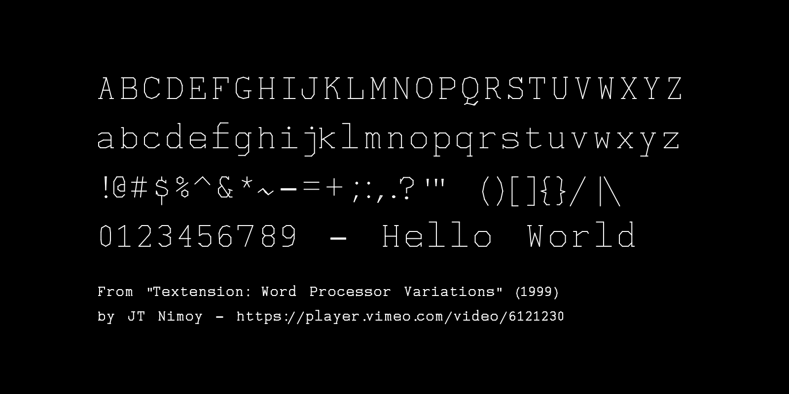

[JT Nimoy](https://jtnimoy.cc/)† (1979–2020) was a prolific software artist and creative technologist, known for her work as part of the CGI team behind *TRON: Legacy*, as well as her voluminous body of experimental creative coding projects spanning more than two decades.

Kyle McDonald assisted in the recovery of the Textension font data by decompiling the [Textension.exe executable](https://acid-play.com/download/textension) with Hex-Rays. [The decompiled C++](textension_windows_app_1999/textension_decompiled.cpp) was ported to p5.js by Golan Levin.

---

### p5.js port of Jared Schiffman's Font

Procedural single-stroke monospace font developed by [Jared Schiffman](https://www.jaredschiffman.com/) at the MIT Media Laboratory Aesthetics and Computation Group, c.1999-2000. Ported from C++ to Java and p5.js by Golan Levin.

* In [this repository](JaredSchiffman/JaredSchiffman_single_line_font/sketch.js)
* At [editor.p5js.org](https://editor.p5js.org/golan/sketches/QVljixLNt)
* [Processing (Java) version](JaredSchiffman/JaredSchiffman_monoline_pde/)

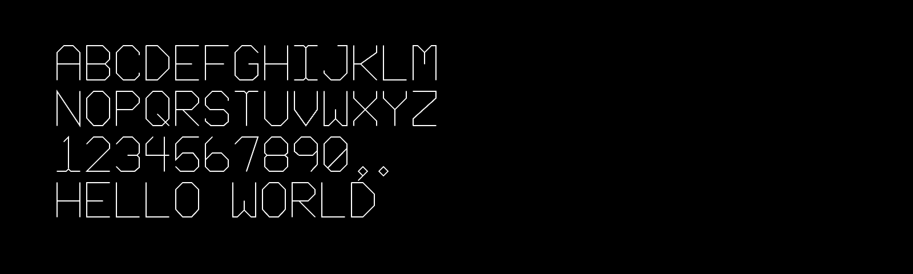

---

### p5.js port of Moebio's *Typode* Font

[*Typode*](https://moebio.com/research/typode/) (2013) is a procedural, grid-based, monospace, single-stroke font by [Santiago Ortiz](https://moebio.com/) (Moebio). Ortiz created *Typode* "to be used in certain information visualization contexts, in which text needs to adapt to specific shapes". Ortiz's demo includes a collection of "transformation" functions which illustrate the computational malleability of procedural fonts. *Typode* was ported to p5.js by Golan Levin in January 2025, and is presented here with permission. A p5.js sketch to parse and display *Typode* is available: 

* In [this repository](moebio_typode/sketch.js)
* At [editor.p5js.org](https://editor.p5js.org/golan/sketches/BPPwoW1FU)

[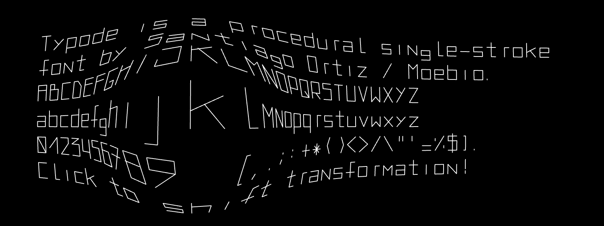](https://editor.p5js.org/golan/sketches/BPPwoW1FU)

---

### p5.js port of Anders Hoff's *GridFont*

*GridFont* is a grid-based system for designing simple symbols and fonts, designed by [Anders Hoff](https://inconvergent.net/) in 2019. It is mainly intended for plotter drawings, and uses a turtle-graphics-like method for defining stroke paths in the glyphs. This p5.js port is adapted from [his repo here](https://github.com/inconvergent/gridfont), with permission. 

Hoff provides two sample fonts: one ("original") which is almost exclusively composed of vertical, horizontal, and 45° angles; and another ("smooth") which has additional line segments, but is still poly-linear. Note that Hoff's demo fonts do not contain capital letters.

* [Original Python code by Anders Hoff](https://github.com/inconvergent/gridfont)
* [p5.js JavaScript port](hoff_gridfont/sketch.js) (in this repository)
* [p5.js JavaScript port](https://editor.p5js.org/golan/sketches/EGWs_gTbR) (at editor.p5js.org)

[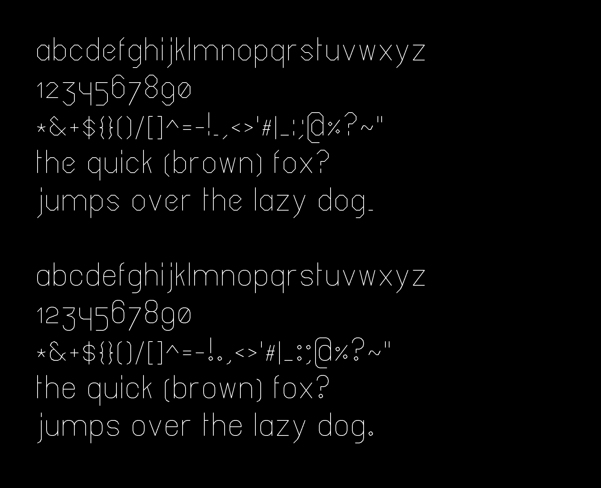](https://editor.p5js.org/golan/sketches/EGWs_gTbR)

---

### *minf*, an Ultra-Minimal Procedural Monoline Font

**minf** is an ultra-minimal [CC0](https://creativecommons.org/public-domain/cc0/) procedural, grid-based, monospace, monoline vector font by Golan Levin (2024). *minf* is intended purely as a pedagogic example in type-golfing. All *minf* glyphs are constructed from a single 4-point polyline: that is, each letter has exactly 4 points, connected by 3 continuous line segments. (None of the line segments have zero length, nor double back on themselves.) No claims whatsoever are made about the attractiveness, legibility, or utility of *minf* (the `M` and `W` are particularly faulty); [some code](minf/sketch.js#L73) is provided to improve it.

Each of the `x` and `y` coordinate values in minf's glyph control points are stored with just 2 bits of resolution. Therefore the entire 26-character font is defined by only {26 letters * 4 points per letter * 2 dimensions per point * 2 bits per number = 416 bits =) 52 bytes of data. In practice it is convenient to store this in a base-64 encoded string, which uses standard ASCII characters; this expands the total storage of the minf font to [a 72-byte string](minf/sketch.js#L15). A p5.js program to load and render *minf* is available in [this repository](minf/sketch.js) and at [editor.p5js.org](https://editor.p5js.org/golan/sketches/C_Xk-gnL3).

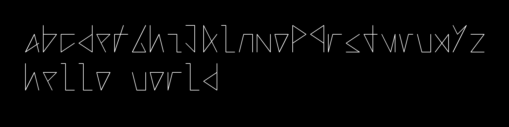

---

### Additional Resources

* [*Drawing with Machines* Typography resources](https://github.com/golanlevin/DrawingWithMachines/blob/main/lectures/topics/type/README.md) by Golan Levin
* [Summary of single-line fonts (10/01/15)](http://www.imajeenyus.com/computer/20150110_single_line_fonts/index.shtml), by imajeenyus.com
* [Singlelinefonts.com](https://singlelinefonts.com/), a commercial foundry for single-line fonts by [Leslie Peppers](https://www.linkedin.com/in/leslie-peppers-a80122181/).
* [OneLineFonts.com](https://www.onelinefonts.com/), a commercial foundry for single-line fonts by [Justin Daniels](https://www.linkedin.com/in/justindaniels/).
* [Drawingbots.net Text Resources](https://drawingbots.net/resources#12), information for plotter enthusiasts.

---

### Some Inspirational Artworks

Here are some inspirational artworks that make use of single-line fonts.

* [Textension: Word Processor Variations](https://vimeo.com/6121230) by JT Nimoy, 1999.
* [Viktor](https://juerglehni.com/works/viktor), [Hektor](https://juerglehni.com/works/hektor), [Otto](https://juerglehni.com/works/otto) by Jürg Lehni, 2002-2014.
* [Typode](https://moebio.com/research/typode/) interactive demo by Santiago Ortiz, 2013.
* [chinese-radical-vis & RRPL](https://chinese-radical-vis.glitch.me/) by Lingdong Huang, 2018.
* [Leon Sans](https://github.com/cmiscm/leonsans) by Jongmin Kim, 2019.
* [Letterform Variations](https://letterformvariations.com/book/) by Nigel Cottier, 2021.
* [X-Y-Z](https://opensea.io/collection/x-y-z-by-andreas-gysin) by Andreas Gysin, 2024.

---

### Todo 

* Interface p5.js to [Leon Sans](https://github.com/cmiscm/leonsans) by Jongmin Kim, 2019

---

### Keywords

single line font, single stroke font, monoline font, vector font, CNC engraving font, skeleton font, procedural font, computational font, SVG Fonts, TTF fonts, Hershey font, AxiDraw, NextDraw, pen plotting, #plotterTwitter, creative coding, typefaces, p5.js, JavaScript, Processing. 
