# p5-single-line-font-resources

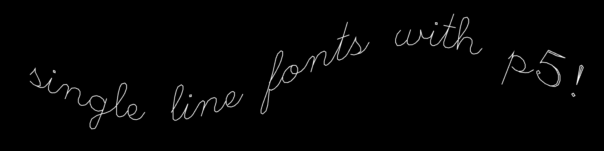

*This is a repository of p5.js (JavaScript) programs for loading and displaying single-line vector fonts (also called single-stroke fonts, stick fonts, or monoline fonts) in a variety of formats — including TTF, SVG Font, Hershey Font, and others. The repository also includes an authoritative archive of single-line fonts (and procedural fonts) adapted from a wide range of creative projects, vintage and obsolete technologies, and other sources.*

*Single-line fonts are ideally suited to creative coding, pen-plotting, laser projection, and CNC machining. Examples in this repository are known to work with [p5.js v.1.11.11](https://cdn.jsdelivr.net/npm/p5@1.11.10/lib/p5.js).*

---

### Contents

* [Minimal SVG Hershey font, inlined in p5.js](#minimal-svg-hershey-font-inlined-in-p5js)
* [p5.js Parser/Renderer for Single-Line SVG Fonts](#p5js-parserrenderer-for-single-line-svg-fonts)
* [p5.js Parser/Renderer for Single-Line TTF Fonts](#p5js-parserrenderer-for-single-line-ttf-fonts)
* [p5.js Parser/Renderer for (Classic) Hershey Fonts](#p5js-parserrenderer-for-classic-hershey-fonts)
* [p5.js port of Saka.N's *KST32B* font, via Kitasenju](#p5js-port-of-sakans-kst32b-font-via-kitasenju)
* [p5.js port of M+ kanji/hanzi font](#p5js-port-of-m-kanjihanzi-font)
* [p5.js port of Kamp's HP1345A vector font](#p5js-port-of-kamps-hp1345a-vector-font)
* [p5.js port of Phooky's Apple 410 vector font](#p5js-port-of-phookys-apple-410-vector-font)
* [p5.js port of Scruss's Commodore 1520 vector font](#p5js-port-of-scrusss-commodore-1520-vector-font)
* [p5.js port of Logg/Hudson's *Asteroids* font](#p5js-port-of-logghudsons-asteroids-font)
* [p5.js implementation of multi-segment display fonts](#p5js-implementation-of-multi-segment-display-fonts)
* [p5.js port of Hofstadter's *Letter Spirit* gridfonts](#p5js-port-of-hofstadters-letter-spirit-gridfonts)
* [p5.js port of JT Nimoy's *Textension* font](#p5js-port-of-jt-nimoys-textension-font)
* [p5.js port of Jongmin Kim's *LeonSans* font](#p5js-port-of-jongmin-kims-leonsans-font)
* [Kielm's p5.js *Space Type Generator* font](#kielms-p5js-space-type-generator-font)
* [Licia He's p5.js *DearPlotter* font](#licia-hes-p5js-dearplotter-font)
* [p5.js port of Moebio's *Typode* font](#p5js-port-of-moebios-typode-font)
* [p5.js port of Anders Hoff's *GridFont*](#p5js-port-of-anders-hoffs-gridfont)
* [p5.js port of Abel Vincze's *GearGenerator* font](#p5js-port-of-abel-vinczes-geargenerator-font)
* [p5.js port of Jared Schiffman's font](#p5js-port-of-jared-schiffmans-font)
* [*minf*, an ultra-minimal procedural monoline font](#minf-an-ultra-minimal-procedural-monoline-font)
* [Additional resources](#additional-resources)
* [Some inspirational artworks](#some-inspirational-artworks)


---

### Minimal SVG Hershey font, inlined in p5.js

> **"I just want something simple"**

*This minimal program presents a SVG font inlined in p5.js, with no loading of external resources.* This program may be useful in circumstances when you just need a simple single-line font, and do not wish to load external files or have any additional library dependencies. It is available:

* In [this repository](Hershey/Hershey_inline_font/sketch.js), and
* At [editor.p5js.org](https://editor.p5js.org/golan/sketches/iqRjuCM-5)
* A [version that saves SVG output files](https://editor.p5js.org/golan/sketches/vjQxbigFg), at editor.p5js.org.

The typeface happens to be a Hershey (polyline) font, converted to the SVG Font format. Note that additional Hershey fonts have also been converted to SVG Font format and are available e.g. [here](https://gitlab.com/oskay/svg-fonts/-/tree/master/fonts/Hershey), [here](https://github.com/Shriinivas/inkscapestrokefont/tree/master/strokefontdata), and [here](https://github.com/techninja/hersheytextjs), as discussed [below](#p5js-parserrenderer-for-single-line-svg-fonts). This code has been adapted from the [hershey font json example](https://editor.p5js.org/allison.parrish/sketches/SJv2DCYpQ) by Allison Parrish.

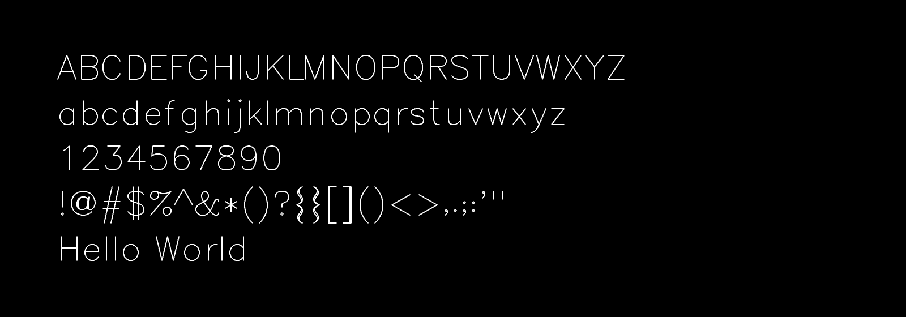

---

### p5.js Parser/Renderer for Single-Line SVG Fonts

[SVG 1.1 Fonts](https://www.w3.org/TR/SVG11/fonts.html) are a lesser-known open font standard, which allow for entire vector fonts to be stored within a single (specially formatted) SVG file. A number of single-line SVG Fonts have been created. *(Note that while SVG 1.1 Fonts are technically SVG files, they don't display normally in SVG viewers.)* [Here is a p5.js program](p5_single_line_svg_fonts/sketch.js) that parses and displays SVG Fonts:

* In [this repository](p5_single_line_svg_fonts/)
* At [editor.p5js.org](https://editor.p5js.org/golan/sketches/T-Vf4vvaR)

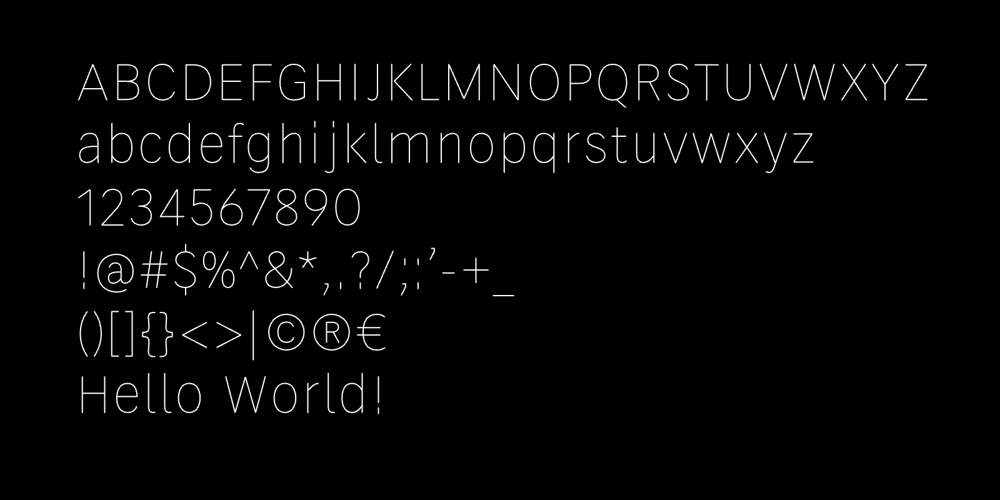

Shown above is the elegant [*Relief*](https://github.com/isdat-type/Relief-SingleLine/) open-source single-line SVG font (rendered by p5.js), developed by a team directed by Prof. François Chastanet at the Graphic Design Department of the Institut Supérieur des Arts et du Design de Toulouse. Note that *Relief* is not a poly-linear font, but instead uses cubic Bézier curves with the SVG `C` (curveTo) and p5.js `bezier()` commands.

Another useful single-stroke SVG 1.1 font presented here is [ISO 3098](https://www.southype.com/Commerce/iso-3098-standard-an-in-depth-guide-to-labeling-and-lettering/) (below), an international standard that provides guidelines for consistent and legible labeling and lettering in technical documentation and engineering drawings. This repository includes both [regular](p5_single_line_svg_fonts/single_line_svg_fonts/ISO3098/ISO3098-Regular.svg) and [italic](p5_single_line_svg_fonts/single_line_svg_fonts/ISO3098/ISO3098-Italic.svg) data in the SVG 1.1 font format, adapted using data from [here](https://domisan.sakura.ne.jp/article/cadfont/cadfont.html).

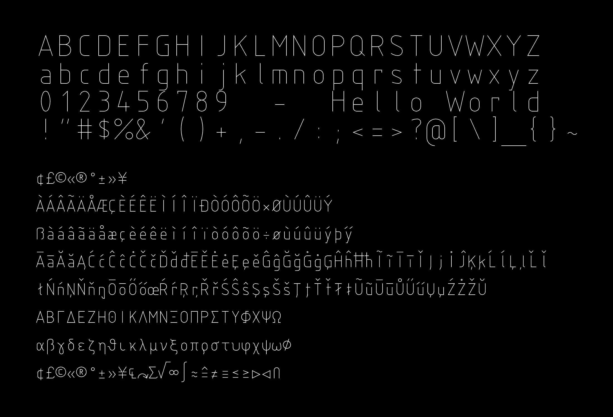

Finally, a very large [archive](p5_single_line_svg_fonts/single_line_svg_fonts/README.md) of compatible SVG single-line fonts is included [here](p5_single_line_svg_fonts/single_line_svg_fonts/README.md), as a mirror of [a collection](https://gitlab.com/oskay/svg-fonts) curated by Dr. Windell Oskay of Evil Mad Scientist Laboratories. (Some of these include SVG Font versions of Hershey fonts.) All of these fonts are supported by the p5.js project here.

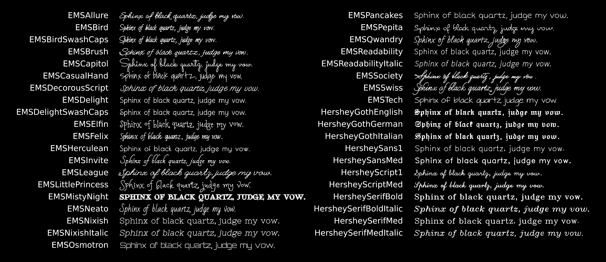

Some additional resources for SVG 1.1 Fonts are:

* [https://gitlab.com/oskay/svg-fonts](https://gitlab.com/oskay/svg-fonts)
* [https://github.com/Shriinivas/inkscapestrokefont](https://github.com/Shriinivas/inkscapestrokefont)
* [https://singlelinefonts.com/collections/svg-fonts](https://singlelinefonts.com/collections/svg-fonts)
* [https://github.com/isdat-type/Relief-SingleLine](https://github.com/isdat-type/Relief-SingleLine)
* [https://www.templatemaker.nl/singlelinetext](https://www.templatemaker.nl/singlelinetext/)


---

### p5.js Parser/Renderer for Single-Line TTF Fonts

Genuine *single-line* TrueType (.TTF) fonts are comparatively rare, and are not rendered properly by most graphics tools — including commercial software like Adobe Illustrator, as well as p5's built-in `text()` command. Here, an [archive](p5_single_line_ttf_fonts/single_stroke_ttf_fonts/) of single-line TTF fonts is provided, as well as a p5.js [program](p5_single_line_ttf_fonts/) which is able to load, parse, display, and provide control points for those fonts:

* An [**archive**](p5_single_line_ttf_fonts/single_stroke_ttf_fonts/) of single-line TTF fonts, as suggested via [imajeenyus.com](http://www.imajeenyus.com/computer/20150110_single_line_fonts/index.shtml). Unlike Hershey fonts, many of these TTFs are constructed from quadratic Bézier segments, and thus have real curves instead of polylines. 
* A [**p5.js program**](p5_single_line_ttf_fonts/sketch.js) to load single-line TTFs in p5.js: In [this repository](p5_single_line_ttf_fonts/), and also at [editor.p5js.org](https://editor.p5js.org/golan/sketches/7kMYzCpfM). Note that the program makes use of [opentype.js](https://opentype.js.org/).
* These fonts have some quirks. Don't ignore these important [**technical notes**](p5_single_line_ttf_fonts/README.md) about the TTF fonts and p5.js code!

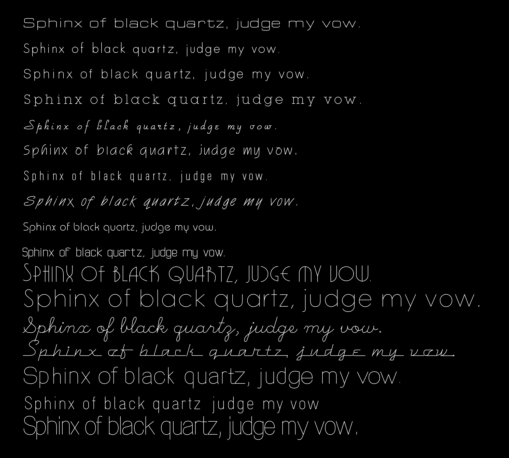


---

### p5.js Parser/Renderer for (Classic) Hershey Fonts

[Hershey Fonts](https://en.wikipedia.org/wiki/Hershey_fonts) are a collection of single-line vector fonts developed in 1967 by Dr. Allen V. Hershey at Dahlgren Naval Weapons Laboratory; they are some of the [earliest digital fonts](https://www.youtube.com/watch?v=xQNHAWrR_eg). The coordinate data for 1,377 Hershey font characters was published by the National Bureau of Standards in 1976, in [*A Contribution to Computer Typesetting Techniques: Tables of Coordinates for Hershey's Repertory of Occidental Type Fonts and Graphic Symbols*](https://books.google.de/books?id=8DOGhKjPAyEC&redir_esc=y); a local copy is [here](Hershey/nbs_1976/tables_of_coordinates_for_hershey_fonts_nbs_1976.pdf) (32MB PDF). Type designer/historian Frank Grießhammer has published a terrific [video lecture about The Hershey Fonts](https://www.youtube.com/watch?v=xQNHAWrR_eg) in 2015.

The authoritative p5.js interface to Hershey Fonts is the [p5-hershey-js](https://github.com/LingDong-/p5-hershey-js) library, by [Lingdong Huang](https://github.com/lingDong-/); a [live demo is here](https://lingdong-.github.io/p5-hershey-js/). (Note that the font data in Lingdong's p5-hershey-js is *not* stored in SVG format!) The p5-hershey-js library provides detailed control of Hershey typography; in this section, I provide some practical p5.js programs that use this library. 

#### hershey-font-demo-svg

This program ([**here**](Hershey/hershey-font-demo-svg/) or at [editor.p5js.org](https://editor.p5js.org/golan/sketches/HufYAfKQr)) provides a simple introduction to the [p5-hershey-js](https://github.com/LingDong-/p5-hershey-js) library. It demonstrates how to: 

* Display text using the default Hershey font
* Display text using a specific Hershey font
* Display text using Lingdong Huang's Chinese Hershey fonts
* Position a Hershey glyph with a specific translation, scale, and rotation.
* *Export* these graphics to an SVG file, using the [p5.plotSvg](https://github.com/golanlevin/p5.plotSvg) library

[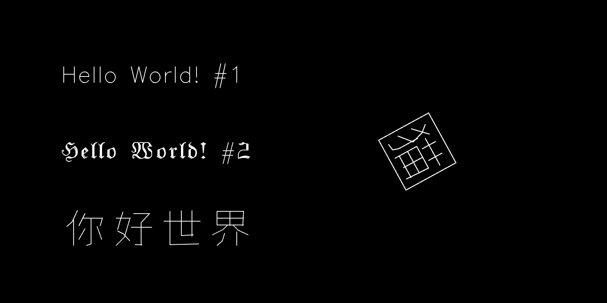](Hershey/hershey-font-demo-svg/)

#### pointwise-hershey-to-svg

This program ([**here**](Hershey/pointwise-hershey-to-svg/) or at [editor.p5js.org](https://editor.p5js.org/golan/sketches/2PJpYMHo1)) also uses the [p5.plotSvg](https://github.com/golanlevin/p5.plotSvg) library to export SVG files of the graphics rendered onscreen. In particular, this demo shows how the [p5-hershey-js](https://github.com/LingDong-/p5-hershey-js) library can be used to render Hershey fonts in 3 different ways: 

1. "Simple", using Lingdong's library API;
2. "Custom", allowing for your own pointwise manipulations;
3. "Single Line", in which all text is an unbroken polyline. 

[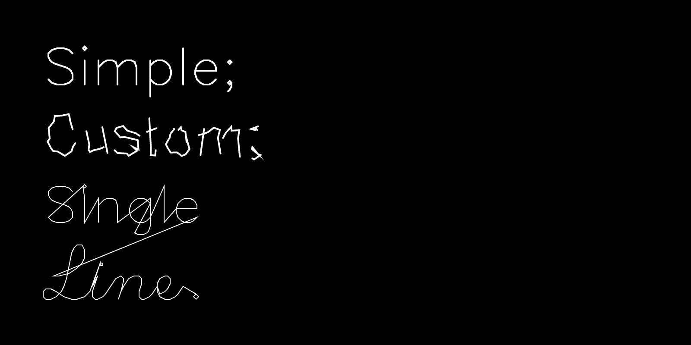](Hershey/pointwise-hershey-to-svg/)

These additional Hershey+p5 resources by Lingdong Huang are noteworthy: 

* [Hershey Font Editor](https://hfedit.glitch.me/). A backup of this project has been archived [here](lingdong_hfedit/index.html).
* [chinese-hershey-font](https://github.com/LingDong-/chinese-hershey-font) with a [live demo here](https://lingdong-.github.io/chinese-hershey-font/)
* [legumes](https://github.com/LingDong-/legumes) Sheet music in polylines using Hershey text
* [hfmath](https://github.com/LingDong-/hfmath) Render LaTeX math with Hershey Fonts
* [ttf2hershey](https://github.com/LingDong-/ttf2hershey) TTF-to-Hershey Converter

Also see: 

* [cnc-text-tool](https://msurguy.github.io/cnc-text-tool/) Browser-based SVG editor with Hershey text overlayer
* [Hershey Font Inkscape plugin](https://wiki.inkscape.org/wiki/index.php/Release_notes/1.0#Hershey_Text) 


---

### p5.js port of Saka.N's *KST32B* font, via Kitasenju

[KST32B](saka_KST32B_font/sketch.js) (Kanji Stroke Table) is a comprehensive monospace single-line font originally designed (c.1992, 2017) by [Saka.N](https://www.vector.co.jp/download/file/data/writing/fh691397.html)<!-- Saka.N.06@b3.mnx.ne.jp -->, covering 4125 characters across multiple scripts: ASCII, half-width kana, hiragana and katakana, Greek, Cyrillic, ISO 8859-15, and both JIS Level 1 and Level 2 kanji. Each glyph is encoded as a compact byte stream of drawing commands on a 30×32 integer grid, using distinct opcodes for horizontal moves, horizontal strokes, and diagonal strokes. In 2014, Saka's work was [added to LibreCAD](https://forum.librecad.org/Japanese-Font-td5710456.html). Inspired by [hgsn](https://x.com/hsgn/status/1413826984413704195), [Kitasenju](https://kitasenjudesign.com/tool/01/) ported Saka.N's original binary data to p5.js, annotating each entry with its Unicode equivalent; this adaptation loads that header directly, keying each glyph by Unicode codepoint for straightforward multilingual text rendering in English, Japanese, Greek, Russian, and Chinese.

* In [this repository](saka_KST32B_font/sketch.js)
* At [editor.p5js.org](https://editor.p5js.org/golan/sketches/shlhouIWh)

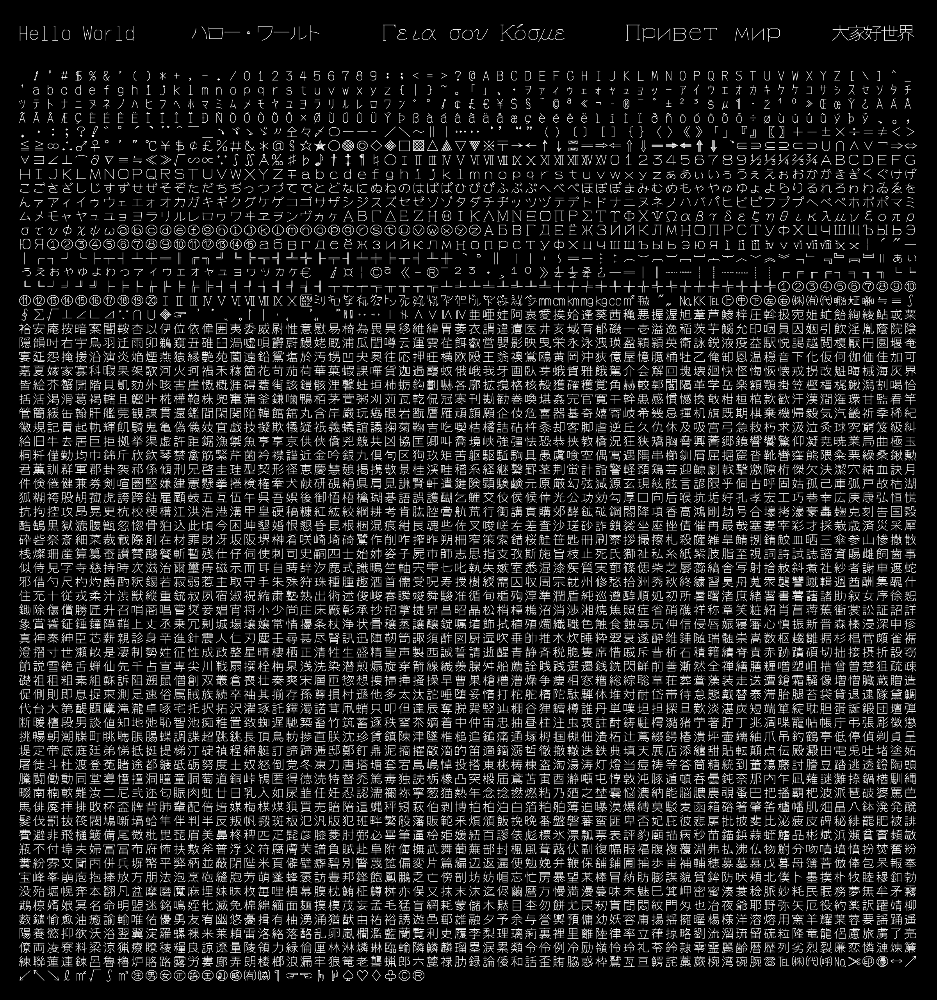

---

### p5.js port of M+ kanji/hanzi font

This is a p5.js adaptation of *M+ Stroke Font*, a single-stroke font specialized for East Asian scripts designed by Coji Morishita of [M+ Fonts Project](https://mplusfonts.github.io/). The font covers the complete hiragana and katakana syllabaries (83 and 87 glyphs respectively) and approximately 5,000 CJK unified ideographs (kanji/hanzi), for a total of ~5,200 single-stroke glyphs. *(Note that an [SVG 1.1 font of the M+ Stroke Font](m_plus_font/source/MPlusStrokeSVG1.1Font.svg) has also been created.)* *M+ Stroke Font* is available:

* In [this repository](m_plus_font/sketch.js)
* At [editor.p5js.org](https://editor.p5js.org/golan/sketches/-Fcfqi5mQ)

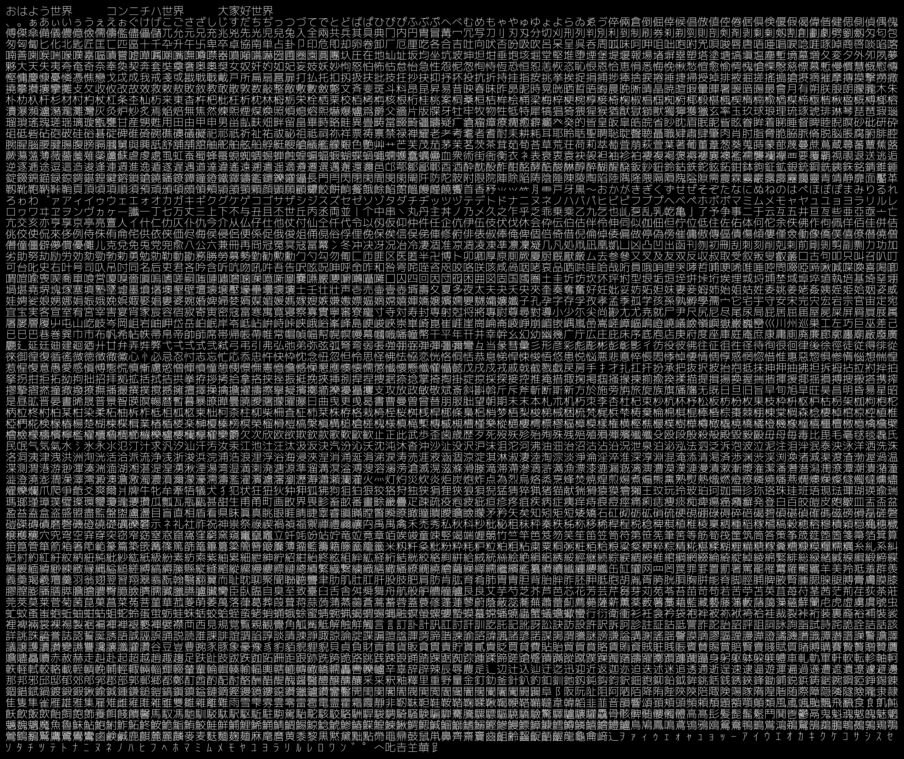

The *M+ Stroke Font* is extracted from the [LibreCAD project](https://librecad.org/), a free open source CAD application (published under GPLv2), from [here](https://domisan.sakura.ne.jp/article/cadfont/cadfont.html).

---

### p5.js port of Kamp's HP1345A vector font

This single-line font is from the character generator ROM of the [HP1345A digital vector display](https://archive.org/details/HP1345AOSM1985) (c.1985), [reverse-engineered](https://phk.freebsd.dk/hacks/Wargames/index.html) by Poul-Henning Kamp, and ported to JavaScript by Golan Levin. This p5.js version is adapted from his work, and loads data from the original ROM binaries.

* ROM-loading version [here](HP1345A/HP1345A_single_line_font/sketch.js) or at [editor.p5js.org](https://editor.p5js.org/golan/sketches/ir_bD05uZ)
* Data-inlined version (*recommended*) [here](HP1345A/HP1345A_single_line_font_inline) or at [editor.p5js.org](https://editor.p5js.org/golan/sketches/TzKV33v9g)

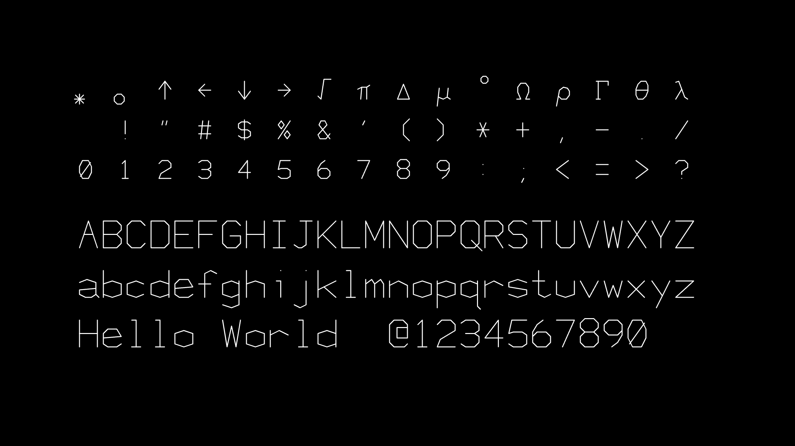

---

### p5.js port of Phooky's Apple 410 vector font

This monospace, monoline vector font is from the [Apple 410 Color Plotter](https://en.wikipedia.org/wiki/Apple_410_Color_Plotter) (c.1983), also sold as the Yokogawa YEW PL-1000. The font was reverse-engineered and extracted from the firmware ROM by Adam Mayer (@phooky), as described in his article, "[Pulling Teeth From a Corpse: Extracting the Vector Font From the Apple 410 Color Plotter](https://www.nycresistor.com/2017/12/29/pulling-teeth-from-a-corpse-extracting-the-vector-font-from-the-apple-410-color-plotter/)". This p5.js version is adapted using the font data and extraction code Meyer released in [this repository](https://github.com/phooky/Apple-410) (MIT license). Meyer explains that the data for each character was stored in a single byte: "the high four bits of the byte indicate the X coordinate, and the low four bits indicate the Y coordinate", thus limiting the design to points on a 16×16 lattice; in other words, it is a grid-font. I have ported these coordinates into a JSON data structure embedded in the p5.js code: 

* In [this repository](apple_410_font/sketch.js)
* At [editor.p5js.org](https://editor.p5js.org/golan/sketches/BytcG0455)

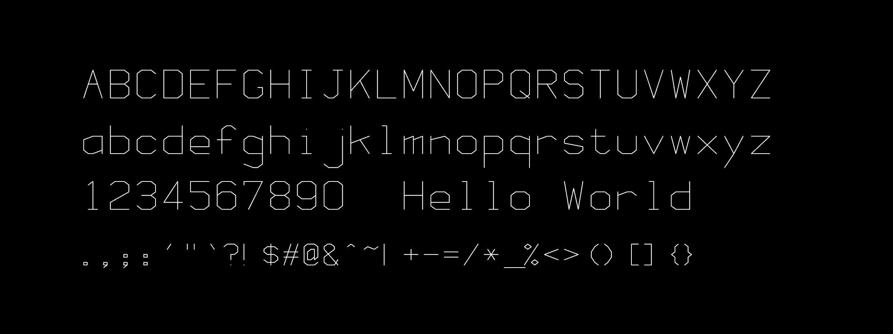

---

### p5.js port of Scruss's Commodore 1520 vector font

This is a vintage monospace, monoline vector font from the [Commodore 1520 Printer Plotter](https://www.youtube.com/watch?v=QwPTluBvKLU) (c.1982), recovered from the original ROM data by Jim Brain, Gerrit Heitsch, Silver Dream, and Stewart C Russell (scruss). More information about the recovery and provenance of this data is available [here](https://scruss.com/blog/2016/04/23/fifteentwenty-commodore-1520-plotter-font/) and [here](https://e4aws.silverdr.com/hacks/6500_1/). A p5.js port of this font by Golan Levin can be found: 

* In [this repository](commodore_1520_font/sketch.js)
* At [editor.p5js.org](https://editor.p5js.org/golan/sketches/XbFlU8q6k)

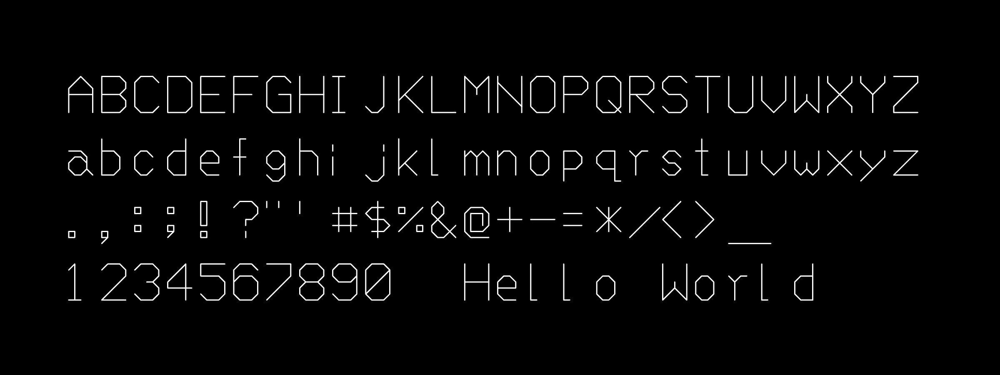


---

### p5.js port of Logg/Hudson's *Asteroids* font

Asteroids game vector font by [Atari programmer Ed Logg](https://web.archive.org/web/20141222010537/http://www.edge-online.com/features/making-asteroids/), c.1979, converted to C by [Trammell Hudson](https://trmm.net/Asteroids_font/), ported to p5.js by Golan Levin. Original C data [here](https://github.com/osresearch/vst/blob/master/teensyv/asteroids_font.c).

* In [this repository](asteroids_font/sketch.js)
* At [editor.p5js.org](https://editor.p5js.org/golan/sketches/OmiU51Gdm)

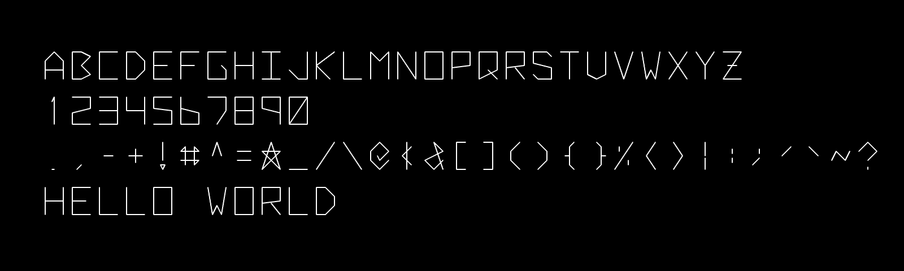


---

### p5.js implementation of multi-segment display fonts

An implementation of 7 segment, 14 segment, and 16 segment LED displays. Based on glyph encodings from Dave Madison's [Segmented LED Display - ASCII Library](https://github.com/dmadison/LED-Segment-ASCII/), under MIT license. Note that full 7-bit ASCII character sets (from codepoints 32 through 127) are supported, though legibility may vary. Designs are based on e.g. the HP/Siemens/Litronix DL-2416 17-segment alphanumeric LED display, etc.

* In [this repository](multisegment_display_fonts/sketch.js)
* At [editor.p5js.org](https://editor.p5js.org/golan/sketches/kLbqPpqwL)

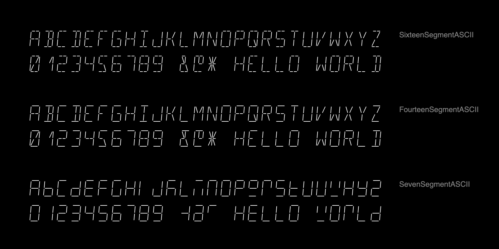


---

### p5.js port of Hofstadter's *Letter Spirit* gridfonts

Douglas Hofstadter’s *Letter Spirit* project (c.1987-1996) explores how abstract concepts like "style" and "analogy" underpin both perception and creativity. It models the human capacity to perceive coherence and invent variation within constraints, proposing that the essence of intelligence lies in fluid, context-sensitive pattern recognition rather than rigid rule-following.

The code in this directory implements some of the *Letter Spirit* gridfonts devised by Hofstadter and Gary McGraw in [*Letter Spirit: An Emergent Model of the Perception and Creation of Alphabetic Style*](hofstadter_letter_spirit_fonts/1993-hofstadter.pdf) (1993). In these fonts, each glyph consists of an array of strokes, and each stroke connects points in a 3x7 design lattice. More information can be found [here](hofstadter_letter_spirit_fonts/readme.md), and code is available: 

* In [this repository](hofstadter_letter_spirit_fonts/letter_spirit_fonts/sketch.js)
* At [editor.p5js.org](https://editor.p5js.org/golan/sketches/_sQ_9xkI4)

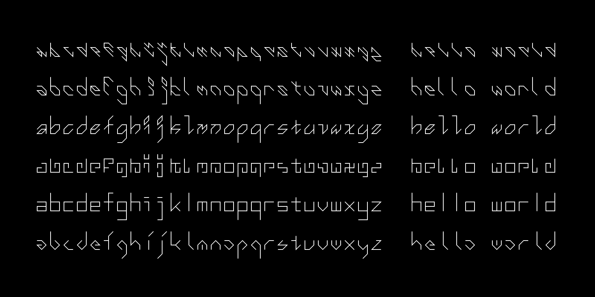

Some more recent related work is [Letterform Variations](https://letterformvariations.com/book/) by [Nigel Cottier](https://process-pattern.com/), 2021.

---

### p5.js port of JT Nimoy's *Textension* font

This repository presents is a p5.js recovery of the handcoded monoline font extracted from [*Textension: Word Processor Variations*](https://jtnimoy.cc/item.php%3Fhandle=14882287-textension-word-processor-variations.html) (1999), an interactive Windows 95/98/XP program developed by JT Nimoy at the Aesthetics & Computation Group of the MIT Media Laboratory. A screen recording of *Textension* can be found [here](https://player.vimeo.com/video/6121230). Nimoy wrote: 

> *"Textension was a collection of 10 interactive experiments in making creative variations of word processing applications. It was my response as an artist to the way programmers always use the typewriter metaphor when they are creating a typesetting application. Textension combines the metaphor of the typewriter with that of other things in the physical world, such as the act of blowing soap bubbles."*

* In [this repository](nimoy_textension/sketch.js)
* At [editor.p5js.org](https://editor.p5js.org/golan/sketches/D4hUCWZk7)

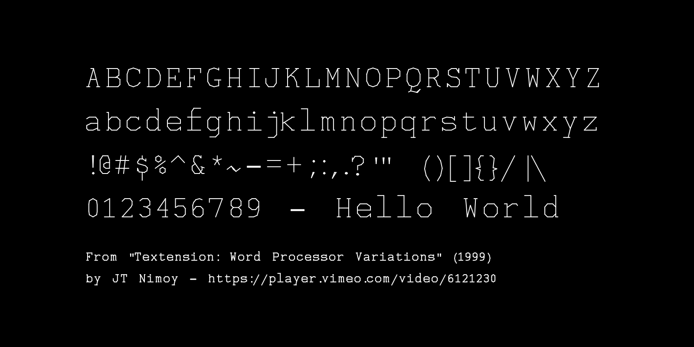

[JT Nimoy](https://jtnimoy.cc/)<sup>†</sup> (1979–2020) was a prolific software artist and creative technologist, known for her work as part of the CGI team behind *TRON: Legacy*, as well as her voluminous body of experimental creative coding projects spanning more than two decades.

Kyle McDonald assisted in the recovery of the Textension font data by decompiling the [Textension.exe executable](https://acid-play.com/download/textension) with Hex-Rays. [The decompiled C++](nimoy_textension/textension_windows_app_1999/textension_decompiled.cpp) was ported to p5.js by Golan Levin.

---

### p5.js port of Jongmin Kim's *LeonSans* font

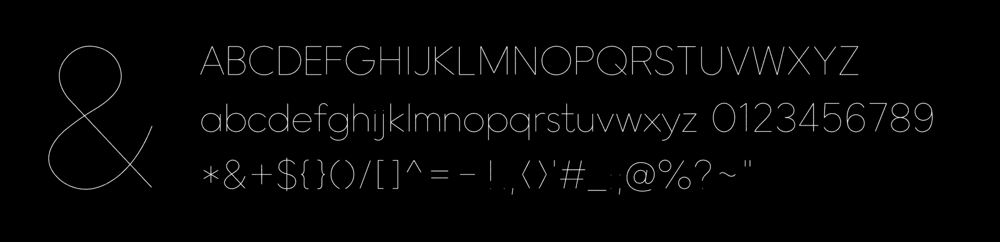

This is a p5.js port of [*LeonSans*](https://github.com/cmiscm/leonsans) by [Jongmin Kim](https://blog.cmiscm.com/) (2019), a procedural single-stroke Latin font. *LeonSans* is distinctive in that it is a [*variable single-stroke font*](https://en.wikipedia.org/wiki/Variable_font): its *weight* parameter (1–900) simultaneously controls both the rendered stroke thickness and the underlying Bézier geometry: control points morph between a thin and a bold variant — so heavier weights produce genuinely different letterforms rather than simply thicker lines. Because of its variable weight, this single-line font may be particularly well-suited to supporting plotting with thick pens. This port also includes a special *roundCaps* option suited for pen-plotters; when enabled, each open stroke endpoint is pulled inward by half the stroke width, ensuring that round-ended strokes land exactly where square caps would. *LeonSans* is available:

* In [this repository](p5_leonsans_font/sketch.js)
* At [editor.p5js.org](https://editor.p5js.org/golan/sketches/aPH2RXnd1)

---

### Kielm's p5.js *Space Type Generator* font

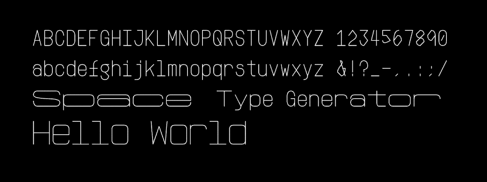

This is an adaptation of an especially versatile, procedural single-stroke monospace font created in p5.js by [Kiel Mutschelknaus](https://www.kielm.com/) (@kielm). Mutschelknaus developed this typeface for his [*Space Type Generator*](https://spacetypegenerator.com/) (2019), a customizable kinetic type generator, and released it under the CC by-nc-sa 4.0 license. A special feature of this typeface is that it allows for horizontal and vertical "stretching" without affecting the shape of the characters' rounded parts. A p5.js sketch for the *Space Type Generator* font is available:

* In [this repository](kielm_spacetypefont/sketch.js)
* At [editor.p5js.org](https://editor.p5js.org/golan/sketches/On-RBvfqR)


---

### Licia He's p5.js *DearPlotter* font

The [*DearPlotter Generator*](https://www.eyesofpanda.com/project/dearplotter_font/) is a program that generates stroke-fonts, created by [Licia He](http://eyesofpanda.com/) through a commission from The Processing Foundation and the Tezos Foundation. The DearPlotter Font Generator is flexibly licensed under [Creative Commons Attribution-ShareAlike 4.0 International](https://creativecommons.org/licenses/by-sa/4.0/) (CC BY-SA 4.0), and the fonts created with it are licensed under The [SIL Open Font License](https://openfontlicense.org/). 

The code presented here reproduces Licia He's underlying ur-font from which all of the *DearPlotter Generator* fonts are derived. He's original renderer converts each arc to a densely-sampled polyline before drawing; this p5.js adaptation instead renders each stroke in a resolution-independent way with p5's native `bezierVertex()`. The *DearPlotter* font is available:

* In [this repository](licia_he_font/sketch.js)
* At [editor.p5js.org](https://editor.p5js.org/golan/sketches/l-7DpKuu-)

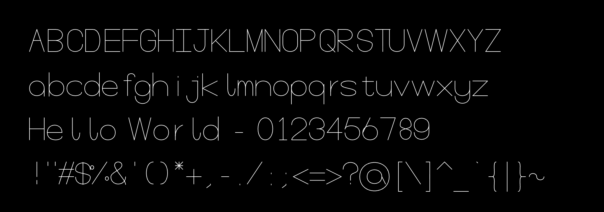

---

### p5.js port of Moebio's *Typode* font

[*Typode*](https://moebio.com/research/typode/) (2013) is a procedural, grid-based, monospace, single-stroke font by [Santiago Ortiz](https://moebio.com/) (Moebio). Ortiz created *Typode* "to be used in certain information visualization contexts, in which text needs to adapt to specific shapes". Ortiz's demo includes a collection of "transformation" functions which illustrate the computational malleability of procedural fonts. *Typode* was ported to p5.js by Golan Levin in January 2025, and is presented here with permission. A p5.js sketch to parse and display *Typode* is available: 

* In [this repository](moebio_typode/sketch.js)
* At [editor.p5js.org](https://editor.p5js.org/golan/sketches/BPPwoW1FU)

[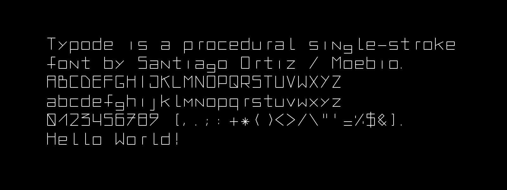](https://editor.p5js.org/golan/sketches/BPPwoW1FU)

---

### p5.js port of Anders Hoff's *GridFont*

*GridFont* is a grid-based system for designing simple symbols and fonts, designed by [Anders Hoff](https://inconvergent.net/) in 2019. It is mainly intended for plotter drawings, and uses a turtle-graphics-like method for defining stroke paths in the glyphs. This p5.js port is adapted from [his repo here](https://github.com/inconvergent/gridfont), with permission. 

Hoff provides two sample fonts: one ("original") which is almost exclusively composed of vertical, horizontal, and 45° angles; and another ("smooth") which has additional line segments, but is still poly-linear. *Note that Hoff's fonts do not contain capital (uppercase) letters.*

* [Original Python code by Anders Hoff](https://github.com/inconvergent/gridfont)
* [p5.js JavaScript port](hoff_gridfont/sketch.js) (in this repository)
* [p5.js JavaScript port](https://editor.p5js.org/golan/sketches/EGWs_gTbR) (at editor.p5js.org)


[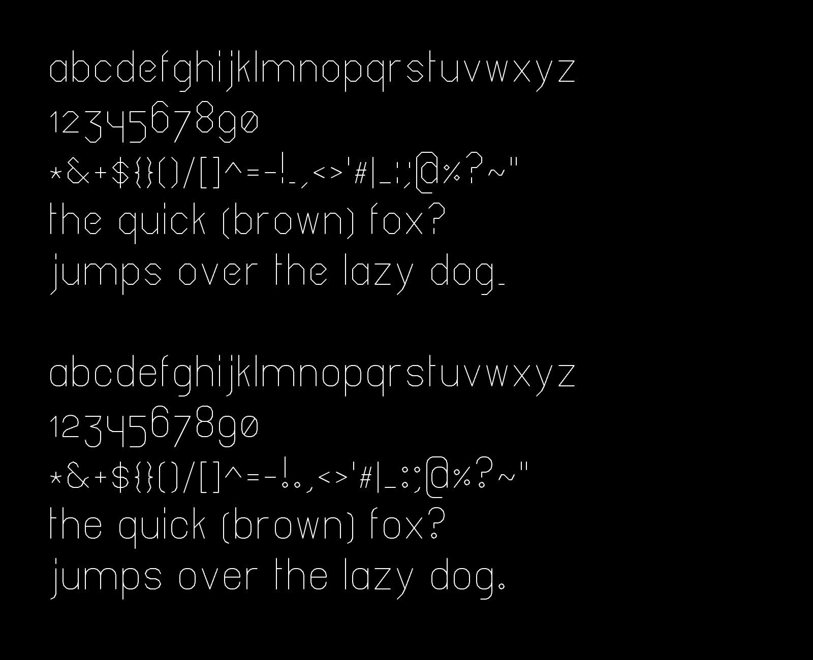](https://editor.p5js.org/golan/sketches/EGWs_gTbR)

---

### p5.js port of Abel Vincze's *GearGenerator* font

p5.js port of the compact single-line font embedded in Abel Vincze's [GearGenerator.com](http://geargenerator.com/) (Iparigrafika, version 1.01), in which it was used to label gears with ratio and RPM text. The font encodes 73 printable characters on a 7×9 integer grid, compressing all glyph stroke data into three strings totalling under 1 KB; ported from [here](https://www.robopenguins.com/assets/wp-content/pages/geargenerator/index.html). 

* In [this repository](vincze_geargenerator_font/sketch.js)
* At [editor.p5js.org](https://editor.p5js.org/golan/sketches/6wem5wbsI)

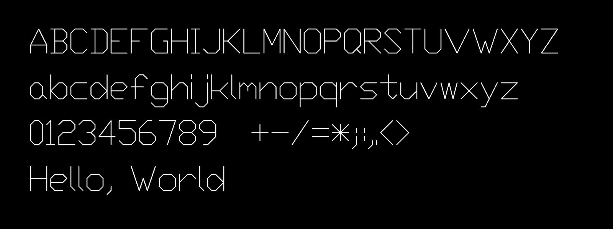

---

### p5.js port of Jared Schiffman's font

Procedural single-stroke monospace font developed by [Jared Schiffman](https://www.jaredschiffman.com/) at the MIT Media Laboratory Aesthetics and Computation Group, c.1999-2000. Ported from C++ to Java and p5.js by Golan Levin.

* In [this repository](schiffman_font/JaredSchiffman_single_line_font/sketch.js)
* At [editor.p5js.org](https://editor.p5js.org/golan/sketches/QVljixLNt)
* [Processing (Java) version](schiffman_font/JaredSchiffman_monoline_pde/)

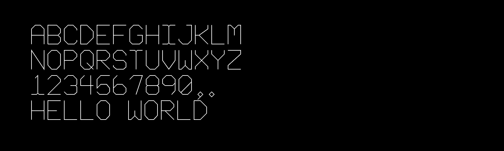

---

### *minf*, an Ultra-Minimal Procedural Monoline Font

**minf** is an ultra-minimal [CC0](https://creativecommons.org/public-domain/cc0/) procedural, grid-based, monospace, monoline vector font by Golan Levin (2024). *minf* is intended purely as a pedagogic example in type-golfing. All *minf* glyphs are constructed from a single 4-point polyline: that is, each letter has exactly 4 points, connected by 3 continuous line segments. (None of the line segments have zero length, nor double back on themselves.) No claims whatsoever are made about the attractiveness, legibility, or utility of *minf* (the `M` and `W` are particularly faulty); [some code](minf/sketch.js#L73) is provided to improve it.

Each of the `x` and `y` coordinate values in minf's glyph control points are stored with just 2 bits of resolution. Therefore the entire 26-character font is defined by only {26 letters * 4 points per letter * 2 dimensions per point * 2 bits per number = 416 bits =) 52 bytes of data. In practice it is convenient to store this in a base-64 encoded string, which uses standard ASCII characters; this expands the total complete storage of the *minf* font to [the 72-byte string](minf/sketch.js#L15): 

```
+T4D0dE+zy1tG4Mdw/oDnxm/CLLTDwR/Nd8x/R1xMNL8HhNd0vOLHRvfF50X/R/TBcMdPw==
```

A p5.js program to load, render, and edit *minf* is available in [this repository](minf/sketch.js) and at [editor.p5js.org](https://editor.p5js.org/golan/sketches/C_Xk-gnL3).

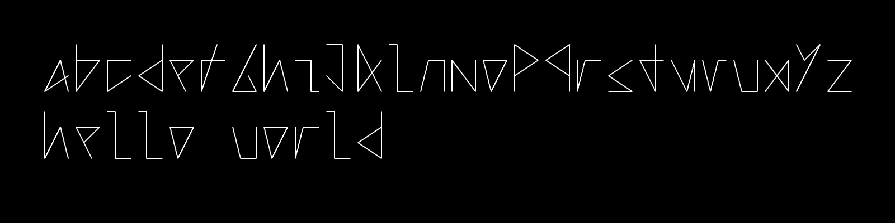

---

### Additional resources

* [*Drawing with Machines* Typography resources](https://github.com/golanlevin/DrawingWithMachines/blob/main/lectures/topics/type/README.md) by Golan Levin
* [Summary of single-line fonts (10/01/15)](http://www.imajeenyus.com/computer/20150110_single_line_fonts/index.shtml), compiled by [Lindsay Robert Wilson](imajeenyus.com).
* [Singlelinefonts.com](https://singlelinefonts.com/), a commercial foundry for single-line fonts by [Leslie Peppers](https://www.linkedin.com/in/leslie-peppers-a80122181/).
* [OneLineFonts.com](https://www.onelinefonts.com/), a commercial foundry for single-line fonts by [Justin Daniels](https://www.linkedin.com/in/justindaniels/).
* [Drawingbots.net](https://drawingbots.net/resources#12), key resources for plotter enthusiasts, maintained by [Maks Surguy](https://makssurguy.com/).

---

### Some inspirational artworks

Here are some inspirational software works that make use of single-line fonts.

* [*DearPlotter Generator*](https://www.eyesofpanda.com/project/dearplotter_font/) by [Licia He](http://eyesofpanda.com/), 2026.
* [*X-Y-Z*](https://opensea.io/collection/x-y-z-by-andreas-gysin) by [Andreas Gysin](https://ertdfgcvb.xyz/), 2024.
* [*Space Type Generator*](https://spacetypegenerator.com) by [Kiel Mutschelknaus](https://www.kielm.com/), 2019.
* [*chinese-radical-vis* & *RRPL*](https://chinese-radical-vis.glitch.me/) by [Lingdong Huang](https://lingdong.works/), 2018.
* [*Leon Sans*](https://github.com/cmiscm/leonsans) by [Jongmin Kim](https://blog.cmiscm.com/), 2019.
* [*Letterform Variations*](https://letterformvariations.com/book/) by [Nigel Cottier](https://process-pattern.com/), 2021.
* [*Typode*](https://moebio.com/research/typode/) by [Santiago Ortiz](https://moebio.com/), 2013.
* [*Viktor*](https://juerglehni.com/works/viktor), [*Hektor*](https://juerglehni.com/works/hektor), and [*Otto*](https://juerglehni.com/works/otto) by [Jürg Lehni](https://juerglehni.com/), 2002-2014.
* [*Textension: Word Processor Variations*](https://vimeo.com/6121230) by [JT Nimoy](https://jtnimoy.cc/), 1999.
* [*Vib Ribbon*](https://www.youtube.com/watch?v=cFXz_xKQa40) by Masaya Matsuura and NanaOn-Sha, 1999.


---

### Todo 

* Vib-Ribbon [font extraction](https://romsfun.com/download/vib-ribbon-58974)
* ROM extraction of HP7596A font
* Fonts from [inkscapestrokefont](https://github.com/Shriinivas/etc/tree/master/inkscapestrokefont/fontsvgs) by Shriinivas
* [Japanese CAD Fonts](https://domisan.sakura.ne.jp/article/cadfont/cadfont.html)
  * https://commons.wikimedia.org/wiki/File:ISO3098.svg
  * https://domisan.sakura.ne.jp/article/cadfont/mplus_stroke.svg


---

### Keywords

*Single line font, single stroke font, stick font, monoline font, vector font, CAD font, CNC engraving font, technical lettering font, pen plotter font, skeletal font, skeleton font, procedural font, procedural typeface, computational font, computational typography, SVG fonts, TTF fonts, Hershey font, AxiDraw, NextDraw, pen plotting, #plotterTwitter, creative coding, typefaces, p5.js, JavaScript, Processing, archive.*
