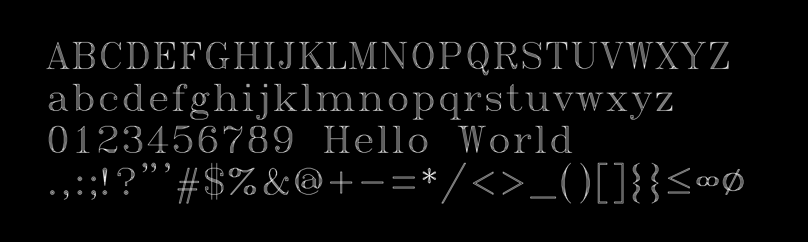
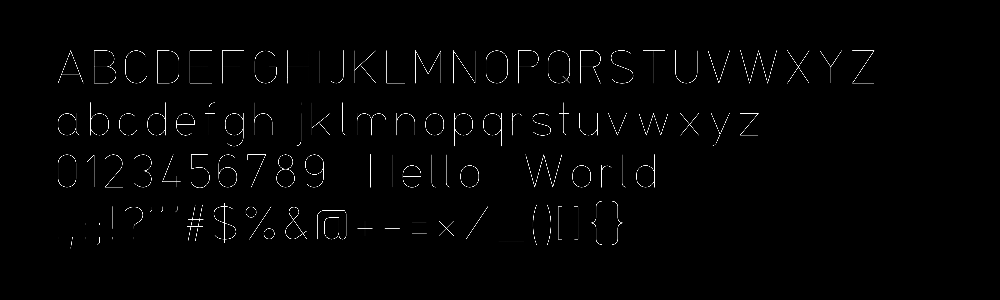
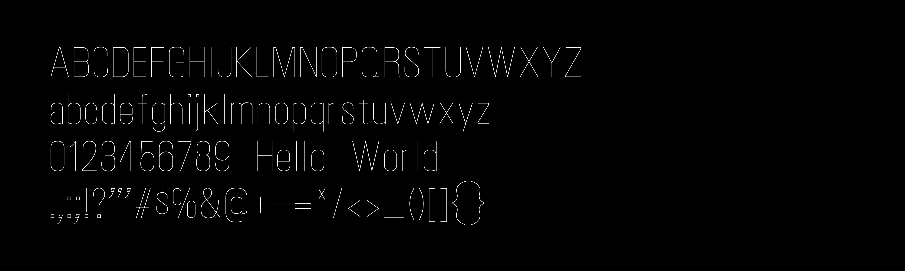
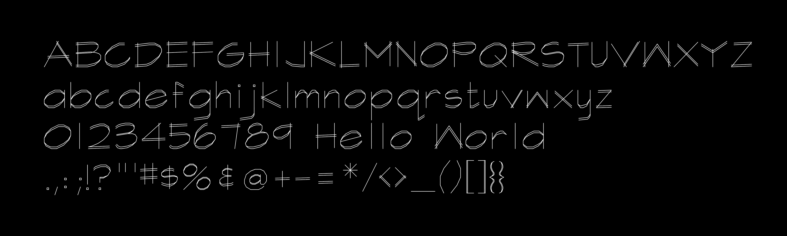
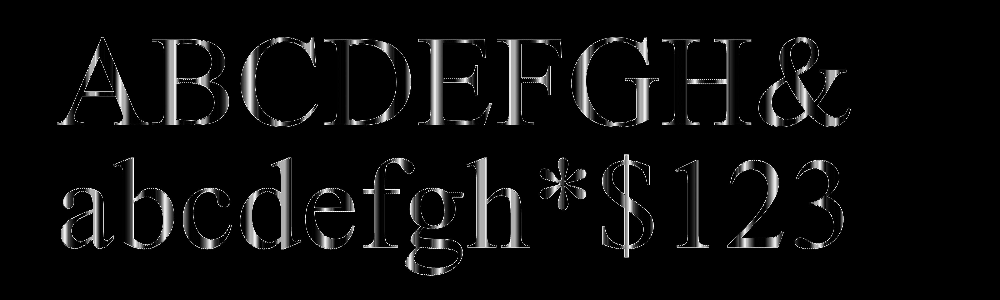
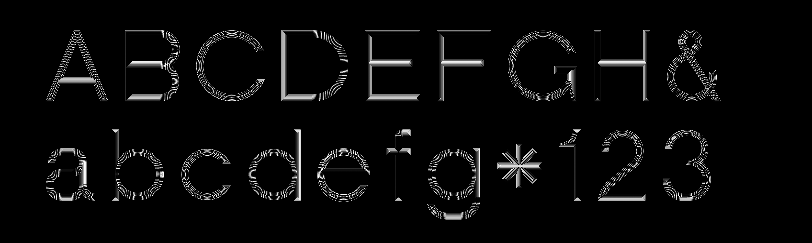
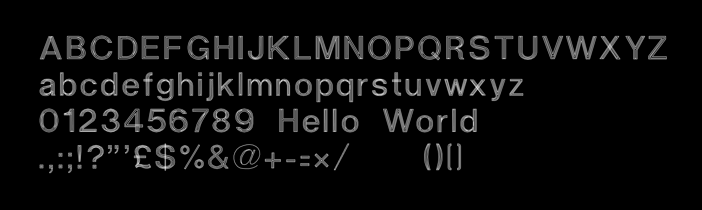

# AutoCAD SHX Stroke Fonts



## Quick Links

* Archive of [SHX fonts](shx/) andf their [SVG preview specimens](svg_specimens/)
* Archive of [SHX fonts converted to JSON](p5_autocad_shx_fonts/json/)
* [**p5.js sketch** that loads and displays JSON versions of SHX fonts](p5_autocad_shx_fonts/sketch.js)
* Some [browsable screenshots of nice SHX fonts](screenshots/)
* [Python SHX decoder/converter](python/shx_decoder.py)

---

## Overview

This directory contains an [archive of AutoCAD binary SHX fonts](shx/); a [p5.js program](p5_autocad_shx_fonts/sketch.js) which loads JSON versions of those SHX fonts; and the [Python code](python/shx_decoder.py) used to decompile and convert the SHX files. 

SHX fonts are one of the long-standing native font/shape formats used in
AutoCAD and AutoCAD-compatible CAD workflows. They are especially common in
technical drawings, architectural plans, engineering documents, title blocks,
linetype symbols, and legacy drawing archives where compact, fast-rendering
stroke lettering is preferred over outline fonts. Many DWG/DXF files depend on
specific `.SHX` fonts for faithful text appearance.

AutoCAD SHX files are **compiled binary files**. They are produced from textual
SHP shape/font descriptions, but the distributed `.shx` files normally contain
only bytecode-like drawing instructions rather than readable point lists. (Note: the
same `.shx` extension is also used by unrelated ESRI shapefile index files; this
project is only concerned with AutoCAD compiled shape/font files.)

### About the SHX Fonts

The SHX fonts in this archive were obtained from the following sources: 

* [Lightburnsoftware.com forum](https://forum.lightburnsoftware.com/t/shx-font-collection/25298) & [Dropbox](https://www.dropbox.com/scl/fo/wdidf525bxbtv09f42g2r/ADHyYaz0Y-tChRIqnbQZmyE?rlkey=3yh1iaf4b5surlyfujknkxolk&e=1&dl=f)
* [San Mateo County Community College District public downloads](https://downloads.smccd.edu/browse/facilitiespublic?fo=%2Fsites%2Fdownloads%2Ffacilities%2FFacilities%20Public%2FReference%20Plans%2FCSM%2FBldg%2010%2FOriginal%20Construction%2FMechanical%2FFonts&n=Fonts)

Some of the fonts in this archive are SHX versions of familiar monoline fonts from other sources: for example, `simplex` and `SCRIPTS8` appear to be derived from Hershey fonts, while `ISO` appears to be an SHX version of ISO 3098. Those fonts appear elsewhere in this repository. 

A few fonts are worth special attention, including attractive monoline versions of DIN, Univers, and several fonts resembling hand-lettering:







However, a few of the SHX fonts are distinctive and potentially quite useful in how they use offset curves and other line-fill techniques to achieve a *pseudo-fill* of glyph bodies — for example, in `TIMESBD`, `hbold`, and `HELV`:








---

## Running the Python SHX Decoder

From this directory:

```sh
python3 python/shx_batch_decode.py shx .
```

That writes batch outputs relative to the current directory:

```text
reports/  Diagnostic Markdown reports
json/     Decoded glyph/shape data
svg/      Debug specimen sheets
shp/      Reconstructed SHP-like text
logs/     Batch log
```

To run the tests:

```sh
python3 -m unittest discover -s python -p 'test_*.py'
```

---

## Python Code

The Python work is in [`python/`](python/):

- [`shx_decoder.py`](shx_decoder.py) is the parser/interpreter module.
- [`shx_batch_decode.py`](shx_batch_decode.py) is the CLI wrapper.
- [`test_shx_decoder.py`](test_shx_decoder.py) contains regression tests for the binary layouts and
  the edge cases found during reverse-engineering.

The module is pure Python; it does not require AutoCAD and does
not invoke external decompilers.


---

## Reverse-Engineered SHX Layouts

The files examined here begin with an ASCII signature terminated by byte
`0x1A`. The signature tells us which compiled layout to use.

### `AutoCAD-86 unifont 1.0`

These are sequential font records. After the signature marker:

```text
uint16 record_count
repeat:
  uint16 shape_number / Unicode-ish character code
  uint16 byte_count
  byte[byte_count] record body
```

The first record is usually font metadata. Later records are glyph programs.
The decoder treats these as text fonts.

### `AutoCAD-86 shapes 1.0` and `AutoCAD-86 shapes 1.1`

These files use an index table followed by concatenated record bodies. After
the signature marker:

```text
uint16 first_shape
uint16 last_shape
uint16 record_count
repeat record_count:
  uint16 shape_number
  uint16 byte_count
then:
  byte[byte_count] record body, in table order
```

Many files with this signature are still text fonts in practice. The decoder
classifies them heuristically: if many printable ASCII shape numbers are
present, the file is reported as a text font compiled as a shape library.

### `AutoCAD-86 bigfont 1.0`

This layout is recognized but not decoded yet. The batch reports identify it
as bigfont diagnostic output rather than forcing it through the normal font
parser.


---

## Record Bodies

Each record body can contain an optional null-terminated name followed by a
compiled SHP opcode stream. The decoder preserves the raw opcode bytes and also
emits a decoded command list.

The interpreter supports:

- `0`: end
- `1`: pen down
- `2`: pen up
- `3`: divide scale
- `4`: multiply scale
- `5`: push current position
- `6`: pop current position
- `7`: draw subshape
- `8`: relative `(dx, dy)` move
- `9`: repeated relative moves ending in `(0, 0)`
- `10`: octant arc
- `11`: fractional arc
- `12`: bulge arc
- `13`: repeated bulge arcs
- `14`: vertical-text-only command skip
- all other bytes: packed vector move, with high nibble length and low nibble
  direction

Important behavior recovered from the sample fonts:

- Shape execution starts with the pen down. Some older fonts rely on this for
  the first stroke of glyphs such as `A`, `M`, `h`, `r`, and `3`.
- Subshape calls start with their own pen-down state, then restore the parent
  pen state. This is needed for fraction glyphs that call a scaled numerator
  subshape while the parent is otherwise pen-up.
- In shape-library files, subshape references are one byte. In unifont files,
  they are two bytes.
- Arc byte `0` in arc opcodes can mean a full 360-degree arc; treating it as
  empty drops closed loop glyphs such as `O` in `hbold.shx`.


---

## Geometry Output

Coordinates are glyph-local SHP coordinates:

- X increases rightward.
- Y increases upward.
- Relative moves are accumulated into absolute coordinates.
- Raw coordinates are not normalized or overwritten.

Each JSON glyph includes:

- shape number / character code
- inferred Unicode character when applicable
- advance width inferred from the final X position
- raw opcode bytes
- decoded opcode sequence
- path geometry using `M`, `L`, and cubic `C` commands
- flattened polylines for consumers that only want point lists
- bounding box
- parse warnings, if any

Arcs are converted to cubic Bezier commands for path output. The same curves
are sampled into polylines for the `polylines` field.


---

## Font Scale Metadata

Different SHX fonts use very different internal coordinate sizes. For example,
`txt.shx` is tiny while `TIMESBD.SHX` is large. The decoder does not alter raw
coordinates. Instead, every JSON file includes font-level metrics:

```json
{
  "metrics": {
    "source_cap_height": 6,
    "normalized_cap_height": 21,
    "normalized_scale": 3.5,
    "scale": 3.5
  },
  "scale": 3.5
}
```

The normalization target is the SIMPLEX-style cap height of `21` units. The p5
viewer multiplies by this `scale` value so fonts render at comparable sizes
while preserving the original decoded coordinates.


---

## p5.js Viewer

[The p5.js viewer](p5_autocad_shx_fonts/sketch.js) loads one decoded JSON file from `json/`, e.g.,:

```js
const currentFontName = "romanc";
```

Change that name in `sketch.js` to preview another decoded font. Press `s` in
the browser to save a PNG screenshot.


---

## Credits And Acknowledgements

### Parser References

This decoder was developed from a combination of:

- Direct byte inspection of the `.SHX` files in `shx/`.
- The decompiled SHP text files used earlier in this project, especially
  `simplex.txt` and `simplex8.txt`, which made it possible to match compiled
  bytes to known SHP opcodes.
- Public AutoCAD SHP/SHX shape-code documentation for the meanings of the
  drawing opcodes: pen up/down, relative moves, packed vector bytes, subshape
  calls, scale changes, push/pop, and arc commands.
- The LibreCAD source tree, checked as an open-source reference point for CAD
  font handling: <https://github.com/LibreCAD/LibreCAD>.

Most of the final parser behavior came from matching local compiled bytes
against observed SHP command behavior, then adding regression tests for the
edge cases found in the supplied fonts.

### Embedded Font Credits

The following names and notices were found inside the SHX binaries themselves
using string extraction. They are recorded here as provenance clues; they are
not necessarily complete licensing statements.

- `ARCHITXT.shx`: `ARchitxt Copr. 1989,1990,1991,1992,1993 Mark L. Crowley, Release 4.1`
- `BVFONT.SHX`: `BVFNTL`
- `CIMPLEX.SHX`: `Roman Simplex 10/23/91`
- `GENISO.SHX` and `g12f13.shx`: `ISO 3098.10 Proportional Spacing ISOCP`
- `HANDLETR.shx` and `HANDLTR.SHX`: `Archstyl Font by Paul J. Aston 12/12/85`
- `ISO8.SHX`: `ISO font extended by MENZI ENGINEERING C 1989`
- `KXT.SHX`: `Standard Font 10/23/91`
- `ROMANS8.SHX`: `Simplex roman extended by MENZI ENGINEERING C 1989`
- `ROMANT.SHX`: `ROMANT Copyright 1996 by Autodesk, Inc.`
- `SCRIPTS8.SHX`: `Simplex script extended by MENZI ENGINEERING C 1989`
- `isocp.shx`: `ISOCP Copyright 1996-2002 by Autodesk, Inc.`
- `isoct.shx`: `ISOCT Copyright © 1997-2002 by Autodesk, Inc.`
- `monotxt.shx`: `MONOTXT Copyright © 1997 by Autodesk,Inc.`
- `romanc.shx`: `ROMANC Copyright 1996 by Autodesk, Inc.`
- `romand.shx`: `ROMAND Copyright 1996 by Autodesk, Inc.`
- `romans.shx`: `ROMANS Copyright © 1997-2004 by Autodesk, Inc.`
- `simplex.shx`: `SIMPLEX Copyright 1996 by Autodesk, Inc.`
- `txt.shx`: `TXT Copyright © 1997-1998 by Autodesk, Inc.`
- `simpfrac.shx`: `Roman SimpFrac 7/30/84 modified 11/8/86`
- `X-HAND1F.shx`: `X-HAND1F, - 3.00 - 10/03/90 - AUTOGRAF U - MBUGBEY`
- `TIMESBD.SHX`: `TimesNewRoman`
- `UNIVCL.SHX`: `nULCSL.SHP`
- `Cdm.shx`: `CDM300-Font`
- `DIN.SHX` and `DINS.SHX`: `nDIN.SHP`
- `HAND.SHX`, `ISO.SHX`, and `ISOS.SHX`: `nISOREC.SHP`
- `HELV.SHX`: `nHELV.SHP`
- `ISOEQ.SHX`: `nISOEQ.SHP`
- `ITENCIL.SHX` and `STENCIL.SHX`: `nLEROY.SHP`
- `MICRO.SHX` and `TICRO.SHX`: `nMICRO.SHP`
- `MSIMPLEX.SHX`: `MSIMPLEX`
- `exthalf2.shx`: `AUGHALF`
- `extslim2.shx`: `AUGJPSLM`


---

<!-- codex resume 019eebc7-0112-7312-b4b7-b5bbafe87475 -->
