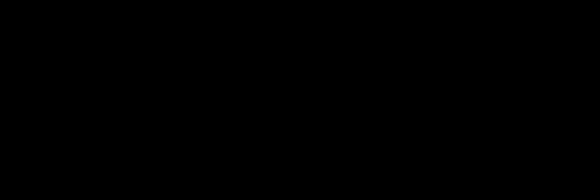
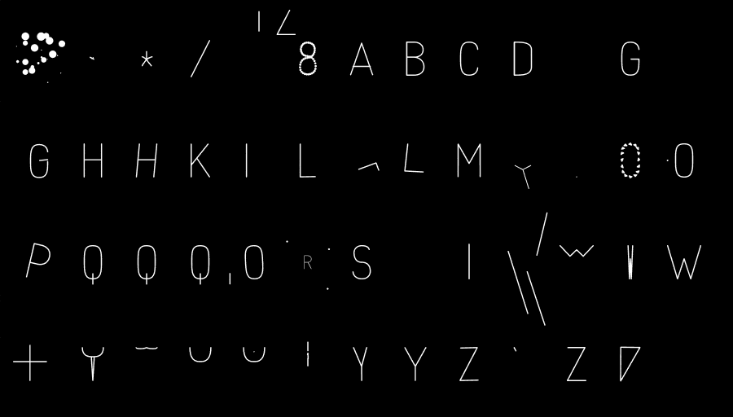

## Jono Brandel's AniType



*AniType* was a participatory online platform for dynamic typography in which users could contribute short JavaScript programs to produce looping, procedurally animated letterforms. The *AniType* website provided an alphabet of computationally malleable Bézier skeletons, an in-browser code editor, a lightweight animation API built on [two.js](https://two.js.org/), and a public gallery in which contributors could publish and remix their animated letters. Created by [Jono Brandel](https://www.jono.fyi/) in 2013 while at Google's Creative Lab Data Arts Team, Brandel envisioned these animations eventually becoming reusable components for expressive web typography.

The original *AniType* website and its submission database are no longer online. Although portions of the source code survive in the Internet Archive, the project's gallery of contributed animations appears to have been lost. This directory presents a partial software archaeology and recovery of the project. Three related applications are included:

* [`anitype_p5/`](anitype_p5/) — a p5.js renderer for the recovered font data, preserving Brandel's original single-stroke glyph representations while providing a modern, dependency-light display and animation environment.
* [`anitype_two/`](anitype_two/) — a modern two.js implementation of the same recovered font, demonstrating the original endpoint representation using current versions of the library on which *AniType* was based.
* [`anitype_relics/`](anitype_relics/) — a compatibility-layer player for surviving *AniType* animations. This recreates the subset of the original *AniType* runtime needed to execute legacy submissions using modern browsers. The collection includes 51 displayed student-authored *AniType* animations from my *Creative Coding* courses (2014–2015), salvaged from archived class websites.


---

# AniType Recovery


This directory contains three small browser apps made while recovering parts of Jono Brandel's AniType project for a single-line font archive. The main goals were:

- preserve the original glyph endpoint data with as little format churn as possible;
- display the recovered single-stroke AniType font in p5.js;
- make a parallel modern two.js display of the same font;
- rescue a small set of student-authored AniType animations from pasted legacy code.

The original AniType project used two.js and represented letters as editable endpoint records. Each point stores a drawing command, an `(x, y)` position, and left/right Bezier controls. This recovery keeps that endpoint structure in JavaScript files loaded directly by each app.

## Contents

```text
anitype_recovery/
  anitype_p5/        p5.js display of the recovered endpoint font
  anitype_two/       modern two.js display of the same endpoint font
  anitype_relics/    two.js player for recovered student AniType animations
  anitype.gif        exported sample GIF
  anitype_relics.gif exported sample GIF of the relic player
```

## `anitype_p5/`


This is the p5.js version of the recovered AniType font display.

Files:

- `index.html` loads p5.js from CDN, then `anitype_endpoints.js`, then `sketch.js`.
- `anitype_endpoints.js` contains the recovered glyph data as a JavaScript object.
- `sketch.js` converts the original endpoint records into sampled contours and draws partial path lengths for animation.
- `style.css` contains the page styling.

The sketch displays the full recovered character set plus `HELLO WORLD`. The animation uses a 4-second loop at the time of this README: draw in, dwell fully drawn, then undraw.

Press `s` or `S` to export one complete loop as a GIF using p5's `saveGif()`. The export is frame-locked rather than wall-clock-driven: while capturing, the sketch advances through `GIF_FRAME_COUNT` deterministic frames so the resulting GIF includes the full draw, dwell, and undraw cycle.

Implementation notes:

- Dots such as the points on `!` and `?` are preserved as zero-length contours and drawn with `point()`.
- The draw state is a normalized path-length reveal from `0...1`, not the original arbitrary AniType animation `t`.
- The endpoint data remains in `anitype_endpoints.js` instead of being loaded from JSON, so the app can run as a static page without asynchronous font loading.

## `anitype_two/`

This is a modern two.js display of the same recovered endpoint font.

Files:

- `index.html` loads `two.min.js`, `anitype_endpoints.js`, and `sketch.js`.
- `two.min.js` is a modern two.js build.
- `anitype_endpoints.js` is the same endpoint-style font data used by the p5 version.
- `sketch.js` builds two.js paths from the endpoints and animates path reveal with each path's `beginning` / `ending` controls.
- `style.css` contains the page styling.

This app is useful as a bridge between the original AniType/two.js model and the p5.js archive display. It renders the static font data, not the student-authored AniType animation hooks.


---

## `anitype_relics/`



This app plays the recovered student AniType animations using a local compatibility layer around the older AniType API.

Files:

- `index.html` loads the legacy runtime pieces and the relic player.
- `two.js`, `tween.js`, `anitype.js`, and `backbone.js` are legacy support files used by the original AniType-style code.
- `student_anitype_letters.js` contains the recovered student submissions. It has been beautified for readability but is otherwise kept close to the pasted source.
- `letters_2014.js` contains an additional recovered 2014 batch. Its pasted syntax was repaired and beautified, then its registrations were merged into `student_anitype_letters.js`.
- `relics.js` collects the registered submissions, sorts them, lays them out, restarts each animation on a synchronized loop, and adds mouseover author labels.
- `style.css` contains the black-canvas/white-line display styling and tooltip styling.

The relic player lays out the combined collection alphabetically in 12 columns and computes the SVG/stage height from the number of rows needed. With the current collection, this produces five rows on a 900x660 stage.

The compatibility layer in `relics.js` reimplements the subset of AniType behavior needed by these submissions:

- `Anitype.register(...)` submissions are collected from `student_anitype_letters.js`.
- `makePolygon(...)`, `addTween(...)`, and `addTick(...)` are mapped onto two.js and tween.js.
- Each relic is rebuilt at the start of every loop, which gives the old one-shot tween code a clean state.
- Mouseover hit zones sit above the SVG, and tooltip movement is throttled through `requestAnimationFrame()`.
