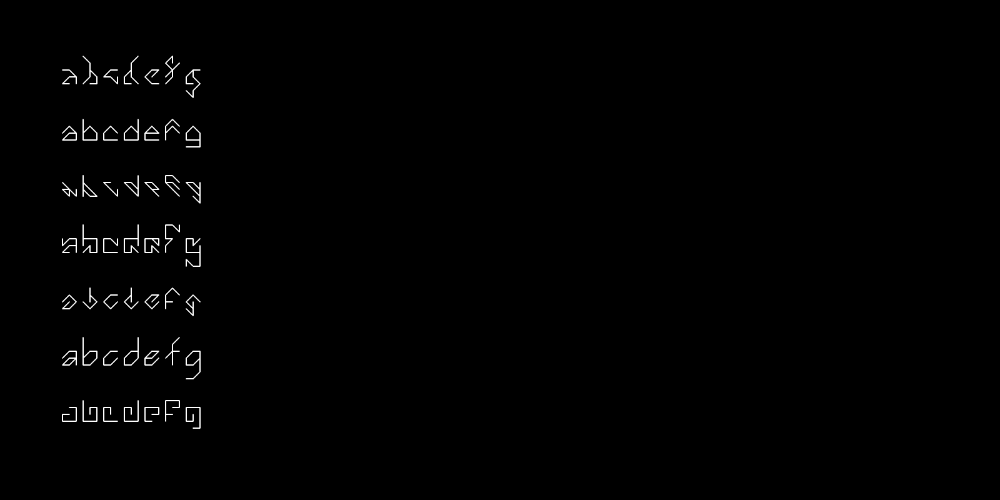

# Letter Spirit Font - Douglas Hofstadter (1993)

Hofstadter’s Letter Spirit project explores how abstract concepts like "style" and "analogy" underpin both perception and creativity. It models the human capacity to perceive coherence and invent variation within constraints, proposing that the essence of intelligence lies in fluid, context-sensitive pattern recognition rather than rigid rule-following.

[This p5.js sketch](https://editor.p5js.org/golan/sketches/_sQ_9xkI4) implements the "Letter Spirit fonts" devised by Douglas Hofstadter and Gary McGraw in [*Letter Spirit: An Emergent Model of the Perception and Creation of Alphabetic Style*](1993-hofstadter.pdf) (1993; original [here](https://gwern.net/doc/design/typography/1993-hofstadter.pdf)), and later elaborated in *Fluid Concepts and Creative Analogies: Computer Models Of The Fundamental Mechanisms Of Thought* (1996). 

Each glyph consists of an array of strokes, encoded as strings. Each string connects points in a lattice, defined by this Letter Spirit Design Grid: 

