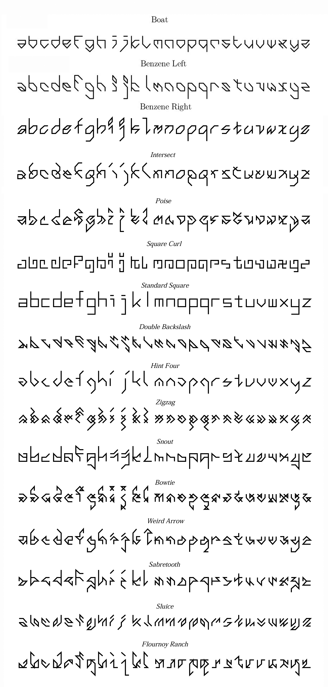

# Letter Spirit Gridfonts - Douglas Hofstadter (1993)

Douglas Hofstadter’s *Letter Spirit* project explores how abstract concepts like "style" and "analogy" underpin both perception and creativity. It models the human capacity to perceive coherence and invent variation within constraints, proposing that the essence of intelligence lies in fluid, context-sensitive pattern recognition rather than rigid rule-following.

* [**p5.js code (live at editor.p5js.org)**](https://editor.p5js.org/golan/sketches/_sQ_9xkI4)
* [**p5.js code (local copy)**](letter_spirit_fonts/sketch.js)

The code in this directory implements some of the *Letter Spirit* gridfonts devised by Douglas Hofstadter and Gary McGraw in [*Letter Spirit: An Emergent Model of the Perception and Creation of Alphabetic Style*](1993-hofstadter.pdf) (1993; original [here](https://gwern.net/doc/design/typography/1993-hofstadter.pdf)), and later elaborated in *Fluid Concepts and Creative Analogies: Computer Models Of The Fundamental Mechanisms Of Thought* (1996). In these fonts, each glyph consists of an array of strokes; each stroke connects points in a lattice, defined by this *Letter Spirit* design grid: 

Some additional *Letter Spirit* fonts, not all of which have been encoded into JavaScript, can be seen below. 

