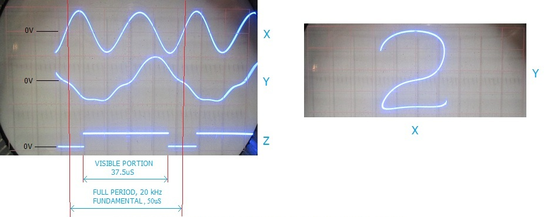

# Fourier Synthesis Character Generator


This directory contains an adaptation of Glen Kleinschmidt's "[Fourier Synthesis Character Generator](https://glensstuff.com/fouriersynthchargen/fouriersynthchargen.htm)", which generates single-stroke vector glyphs using a custom analog circuit. In Kleinschmidt's circuit, a number of sinusoidal oscillators have frequencies set by resistor values, as depicted in his circuit diagram [`romschematic.pdf`](romschematic.pdf). Kleinschmidt's circuit only represents the sixteen characters, `0-9` and `A-F`. His circuit synthesizes each character as a 2-dimensional parametric curve, such as one would see on an oscilloscope, summing the contributions of five such oscillators in each of the X and Y dimension. 



The table below is based on the ROM resistor matrix in [`romschematic.pdf`](romschematic.pdf), with the adjusted values used by the p5 sketch. The component reference is included in parentheses. Smaller resistor values produce larger terms because the summing weight is proportional to conductance, `1/R`. Each X or Y deflection waveform is a passive sum of selected 1-volt peak source terms:

- `sinN` means `sin(Nwt)`.
- `-sinN` means `-sin(Nwt)`.
- `cosN` means `cos(Nwt)`.
- `-cosN` means `-cos(Nwt)`.
- `+dc` and `-dc` are the +12 V and -12 V DC offset buses.

The visible character trace is six eighths of the waveform period; the remaining two eighths are the blanked return segment as described in his page. A local copy of his project page is [here](fouriersynthchargen.mhtml).


---

## Extracted ROM Table

| Char | X terms | Y terms |
| --- | --- | --- |
| 0 | sin1 75k (R95); -sin2 130k (R96); -sin3 270k (R97); -sin4 560k (R98); -sin5 1M5 (R99) | -cos1 56k (R100); cos2 180k (R101); cos3 470k (R102); cos4 820k (R103); cos5 2M2 (R104); -dc 4M7 (R105) |
| 1 | none | cos5 62k (R106) |
| 2 | -sin1 680k (R107); -cos1 910k (R108); sin2 56k (R109); cos2 160k (R110); sin3 360k (R111); +dc 20M (R112) | -sin1 56k (R113); -cos1 360k (R114); -cos2 430k (R115); sin3 510k (R116); cos3 2M2 (R117); -sin4 2M4 (R118); cos4 1M3 (R119); sin5 1M (R120); cos5 1M5 (R121); -dc 5M1 (R122) |
| 3 | -cos1 56k (R123); -cos2 180k (R124); cos3 150k (R125); -cos4 1M5 (R126); cos5 510k (R127); -dc 20M (R128) | -sin1 62k (R129); -cos1 1M (R130); -sin2 300k (R131); sin3 390k (R132) |
| 4 | sin1 150k (R133); cos1 100k (R134); -sin2 110k (R135); cos2 430k (R136); -cos3 430k (R137); -sin4 2M7 (R138); sin5 2M (R139); +dc 3M6 (R140) | -sin1 560k (R141); -cos1 75k (R142); -sin2 110k (R143); -cos2 820k (R144); -sin3 1M2 (R145); -cos3 2M7 (R146); -sin4 820k (R147); -sin5 2M7 (R148); +dc 12M (R149) |
| 5 | sin1 430k (R150); cos1 560k (R151); -sin2 62k (R152); -sin3 560k (R153); cos3 430k (R154); -sin4 910k (R155); -cos4 1M5 (R156); sin5 1M5 (R157); cos5 430k (R158); -dc 20M (R159) | -sin1 56k (R160); cos1 1M6 (R161); -sin2 430k (R162); cos2 430k (R163); sin3 430k (R164); -sin4 910k (R165); sin5 820k (R166); -cos5 2M7 (R167); +dc 6M8 (R168) |
| 6 | -sin1 470k (R169); cos1 220k (R170); sin2 56k (R171); sin3 430k (R172); cos3 240k (R173); -dc 30M (R174) | sin1 100k (R175); cos1 200k (R176); -cos2 91k (R177); sin3 510k (R178); -dc 30M (R179) |
| 7 | -cos1 39k (R180); -cos2 36k (R181); -cos3 110k (R182); -cos4 750k (R183); -cos5 1M (R184); -dc 1M8 (R185) | cos1 51k (R186); -cos2 180k (R187); cos3 270k (R188); cos4 1M (R189); cos5 680k (R190); +dc 1M5 (R191) |
| 8 | sin1 430k (R192); sin2 130k (R193); -sin3 68k (R194); -sin4 330k (R195); -sin5 910k (R196) | -cos1 68k (R197); cos2 180k (R198); cos3 680k (R199); cos4 270k (R200); cos5 2M7 (R201); -dc 4M7 (R202) |
| 9 | sin1 470k (R203); -cos1 220k (R204); -sin2 56k (R205); -sin3 430k (R206); -cos3 240k (R207); +dc 30M (R208) | -sin1 100k (R209); -cos1 200k (R210); cos2 91k (R211); -sin3 510k (R212); +dc 30M (R213) |
| A | cos1 56k (R214); -cos2 150k (R215); cos3 510k (R216); cos4 750k (R217); cos5 1M8 (R218); +dc 2M (R219) | sin1 560k (R220); -sin2 100k (R221); -sin3 510k (R222); -sin4 1M3 (R223); -dc 1M6 (R224) |
| B | sin1 100k (R225); -cos1 82k (R226); -sin2 130k (R227); -cos2 150k (R228); -cos4 620k (R229); -cos5 1M5 (R230); -dc 1M6 (R231) | -sin1 150k (R232); cos1 130k (R233); -sin2 91k (R234); cos2 150k (R235); sin3 1M5 (R236); -cos3 470k (R237); -sin4 1M8 (R238); cos4 1M8 (R239); -sin5 1M5 (R240); -cos5 2M2 (R241); -dc 4M7 (R242) |
| C | cos1 43k (R243); +dc 3M3 (R244) | sin1 100k (R245); -dc 1M5 (R246) |
| D | -sin1 100k (R247); cos1 82k (R248); sin2 130k (R249); cos2 150k (R250); cos4 620k (R251); cos5 1M5 (R252); +dc 1M6 (R253) | -sin1 150k (R254); cos1 130k (R255); -sin2 91k (R256); cos2 150k (R257); sin3 1M5 (R258); -cos3 470k (R259); -sin4 1M8 (R260); cos4 1M8 (R261); -sin5 1M5 (R262); -cos5 2M2 (R263); -dc 4M7 (R264) |
| E | -sin1 470k (R265); cos1 220k (R266); sin2 56k (R267); sin3 430k (R268); cos3 240k (R269); -dc 30M (R270) | -sin1 100k (R271); -cos1 200k (R272); cos2 91k (R273); -sin3 510k (R274); -dc 820k (R275) |
| F | -sin1 180k (R276); cos1 68k (R277); -sin2 220k (R278); cos2 100k (R279); cos3 330k (R280); -sin5 1M (R281); cos5 3M3 (R282); +dc 30M (R283) | -sin1 110k (R284); cos1 110k (R285); -sin2 910k (R286); -cos2 150k (R287); -sin3 750k (R288) |


---

## Coefficient Equations

The following equations use the adjusted resistor values above. Coefficients are normalized conductance weights: sinusoidal terms use `100k / R`, while DC terms use `12 * 100k / R`. The variable `t` is the phase angle over one waveform period.

| Char | X equation | Y equation |
| --- | --- | --- |
| 0 | `x = 1.33*sin(1*t) - 0.77*sin(2*t) - 0.37*sin(3*t) - 0.18*sin(4*t) - 0.07*sin(5*t)` | `y = -1.79*cos(1*t) + 0.56*cos(2*t) + 0.21*cos(3*t) + 0.12*cos(4*t) + 0.05*cos(5*t) - 0.26` |
| 1 | `x = 0` | `y = 1.61*cos(5*t)` |
| 2 | `x = -0.15*sin(1*t) - 0.11*cos(1*t) + 1.79*sin(2*t) + 0.63*cos(2*t) + 0.28*sin(3*t) + 0.06` | `y = -1.79*sin(1*t) - 0.28*cos(1*t) - 0.23*cos(2*t) + 0.2*sin(3*t) + 0.05*cos(3*t) - 0.04*sin(4*t) + 0.08*cos(4*t) + 0.1*sin(5*t) + 0.07*cos(5*t) - 0.24` |
| 3 | `x = -1.79*cos(1*t) - 0.56*cos(2*t) + 0.67*cos(3*t) - 0.07*cos(4*t) + 0.2*cos(5*t) - 0.06` | `y = -1.61*sin(1*t) - 0.1*cos(1*t) - 0.33*sin(2*t) + 0.26*sin(3*t)` |
| 4 | `x = 0.67*sin(1*t) + 1*cos(1*t) - 0.91*sin(2*t) + 0.23*cos(2*t) - 0.23*cos(3*t) - 0.04*sin(4*t) + 0.05*sin(5*t) + 0.33` | `y = -0.18*sin(1*t) - 1.33*cos(1*t) - 0.91*sin(2*t) - 0.12*cos(2*t) - 0.08*sin(3*t) - 0.04*cos(3*t) - 0.12*sin(4*t) - 0.04*sin(5*t) + 0.1` |
| 5 | `x = 0.23*sin(1*t) + 0.18*cos(1*t) - 1.61*sin(2*t) - 0.18*sin(3*t) + 0.23*cos(3*t) - 0.11*sin(4*t) - 0.07*cos(4*t) + 0.07*sin(5*t) + 0.23*cos(5*t) - 0.06` | `y = -1.79*sin(1*t) + 0.06*cos(1*t) - 0.23*sin(2*t) + 0.23*cos(2*t) + 0.23*sin(3*t) - 0.11*sin(4*t) + 0.12*sin(5*t) - 0.04*cos(5*t) + 0.18` |
| 6 | `x = -0.21*sin(1*t) + 0.45*cos(1*t) + 1.79*sin(2*t) + 0.23*sin(3*t) + 0.42*cos(3*t) - 0.04` | `y = 1*sin(1*t) + 0.5*cos(1*t) - 1.1*cos(2*t) + 0.2*sin(3*t) - 0.04` |
| 7 | `x = -2.56*cos(1*t) - 2.78*cos(2*t) - 0.91*cos(3*t) - 0.13*cos(4*t) - 0.1*cos(5*t) - 0.67` | `y = 1.96*cos(1*t) - 0.56*cos(2*t) + 0.37*cos(3*t) + 0.1*cos(4*t) + 0.15*cos(5*t) + 0.8` |
| 8 | `x = 0.23*sin(1*t) + 0.77*sin(2*t) - 1.47*sin(3*t) - 0.3*sin(4*t) - 0.11*sin(5*t)` | `y = -1.47*cos(1*t) + 0.56*cos(2*t) + 0.15*cos(3*t) + 0.37*cos(4*t) + 0.04*cos(5*t) - 0.26` |
| 9 | `x = 0.21*sin(1*t) - 0.45*cos(1*t) - 1.79*sin(2*t) - 0.23*sin(3*t) - 0.42*cos(3*t) + 0.04` | `y = -1*sin(1*t) - 0.5*cos(1*t) + 1.1*cos(2*t) - 0.2*sin(3*t) + 0.04` |
| A | `x = 1.79*cos(1*t) - 0.67*cos(2*t) + 0.2*cos(3*t) + 0.13*cos(4*t) + 0.06*cos(5*t) + 0.6` | `y = 0.18*sin(1*t) - 1*sin(2*t) - 0.2*sin(3*t) - 0.08*sin(4*t) - 0.75` |
| B | `x = 1*sin(1*t) - 1.22*cos(1*t) - 0.77*sin(2*t) - 0.67*cos(2*t) - 0.16*cos(4*t) - 0.07*cos(5*t) - 0.75` | `y = -0.67*sin(1*t) + 0.77*cos(1*t) - 1.1*sin(2*t) + 0.67*cos(2*t) + 0.07*sin(3*t) - 0.21*cos(3*t) - 0.06*sin(4*t) + 0.06*cos(4*t) - 0.07*sin(5*t) - 0.05*cos(5*t) - 0.26` |
| C | `x = 2.33*cos(1*t) + 0.36` | `y = 1*sin(1*t) - 0.8` |
| D | `x = -1*sin(1*t) + 1.22*cos(1*t) + 0.77*sin(2*t) + 0.67*cos(2*t) + 0.16*cos(4*t) + 0.07*cos(5*t) + 0.75` | `y = -0.67*sin(1*t) + 0.77*cos(1*t) - 1.1*sin(2*t) + 0.67*cos(2*t) + 0.07*sin(3*t) - 0.21*cos(3*t) - 0.06*sin(4*t) + 0.06*cos(4*t) - 0.07*sin(5*t) - 0.05*cos(5*t) - 0.26` |
| E | `x = -0.21*sin(1*t) + 0.45*cos(1*t) + 1.79*sin(2*t) + 0.23*sin(3*t) + 0.42*cos(3*t) - 0.04` | `y = -1*sin(1*t) - 0.5*cos(1*t) + 1.1*cos(2*t) - 0.2*sin(3*t) - 1.46` |
| F | `x = -0.56*sin(1*t) + 1.47*cos(1*t) - 0.45*sin(2*t) + 1*cos(2*t) + 0.3*cos(3*t) - 0.1*sin(5*t) + 0.03*cos(5*t) + 0.04` | `y = -0.91*sin(1*t) + 0.91*cos(1*t) - 0.11*sin(2*t) - 0.67*cos(2*t) - 0.13*sin(3*t)` |

---

## p5.js Sketch

A p5.js implementation for this project can be found: 

* At [editor.p5js.org](https://editor.p5js.org/golan/sketches/NYn_eUfRH)
* In [this repository](glenk_fourier/sketch.js).

This sketch contains the same table as data and evaluates the glyphs as Fourier sums:

```text
x(t) = sum(X character terms)
y(t) = sum(Y character terms)
```

No character is stored as a point list. The sketch samples the functions only while drawing. The bright trace covers the visible six-eighths of the waveform, and the dim trace shows the blanked return interval.

---

<!-- codex resume 019ee719-7b31-7462-897d-6ede47a07181 -->